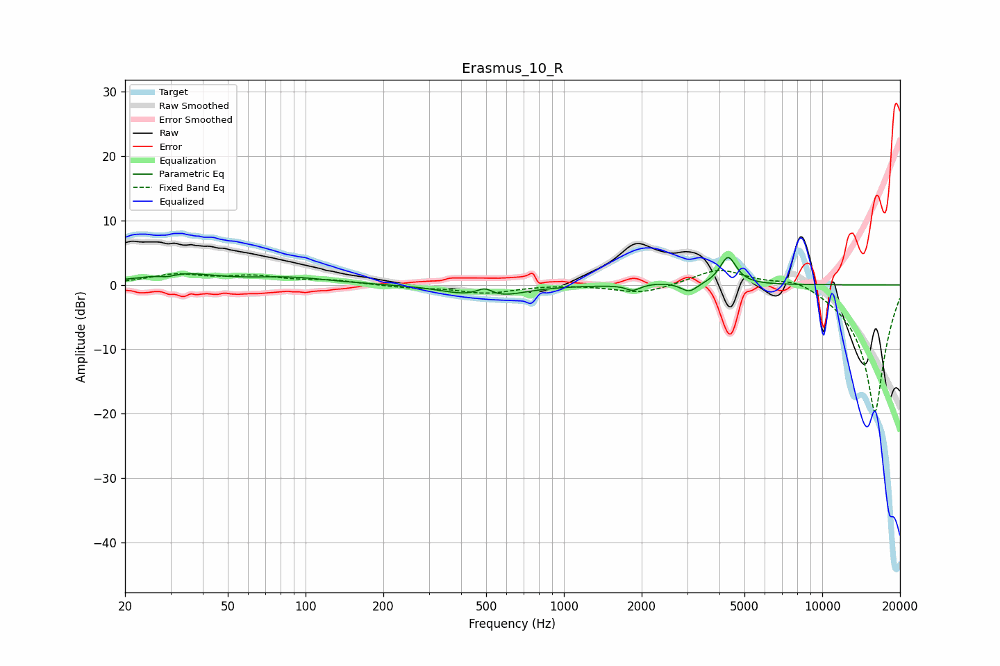

# Erasmus_10_R
See [usage instructions](https://github.com/jaakkopasanen/AutoEq#usage) for more options and info.

### Parametric EQs
Apply preamp of -4.3 dB when using parametric equalizer.

|   # | Type    |   Fc (Hz) |    Q |   Gain (dB) |
|-----|---------|-----------|------|-------------|
|   1 | Peaking |        29 | 4.19 |        -0.5 |
|   2 | Peaking |        32 | 1.04 |         1.7 |
|   3 | Peaking |        87 | 0.9  |         1   |
|   4 | Peaking |       393 | 1.47 |        -0.7 |
|   5 | Peaking |       494 | 4.46 |         1.3 |
|   6 | Peaking |       547 | 1.35 |        -1.6 |
|   7 | Peaking |      1849 | 5.44 |        -0.9 |
|   8 | Peaking |      2447 | 2.01 |         0.4 |
|   9 | Peaking |      3053 | 4.51 |        -1.4 |
|  10 | Peaking |      4321 | 4.49 |         4.4 |

### Fixed Band EQs
When using fixed band (also called graphic) equalizer, apply preamp of **-2.3 dB** (if available) and set gains manually with these parameters.

|   # | Type    |   Fc (Hz) |    Q |   Gain (dB) |
|-----|---------|-----------|------|-------------|
|   1 | Peaking |        31 | 1.41 |         1.5 |
|   2 | Peaking |        62 | 1.41 |         1.2 |
|   3 | Peaking |       125 | 1.41 |         0.6 |
|   4 | Peaking |       250 | 1.41 |        -0.4 |
|   5 | Peaking |       500 | 1.41 |        -1.2 |
|   6 | Peaking |      1000 | 1.41 |         0.1 |
|   7 | Peaking |      2000 | 1.41 |        -1.4 |
|   8 | Peaking |      4000 | 1.41 |         2.6 |
|   9 | Peaking |      8000 | 1.41 |         1.6 |
|  10 | Peaking |     16000 | 1.41 |       -20   |

### Graphs

