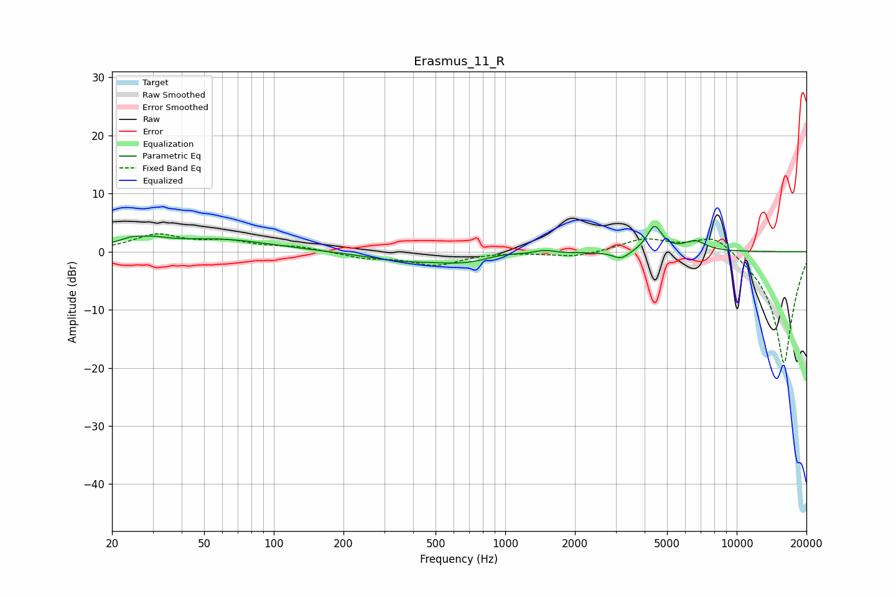

# Erasmus_11_R
See [usage instructions](https://github.com/jaakkopasanen/AutoEq#usage) for more options and info.

### Parametric EQs
Apply preamp of -4.4 dB when using parametric equalizer.

|   # | Type    |   Fc (Hz) |    Q |   Gain (dB) |
|-----|---------|-----------|------|-------------|
|   1 | Peaking |        27 | 1.9  |         2.7 |
|   2 | Peaking |        27 | 3.23 |        -0.9 |
|   3 | Peaking |        58 | 0.62 |         2   |
|   4 | Peaking |       347 | 0.88 |        -1.2 |
|   5 | Peaking |       761 | 0.88 |        -2.4 |
|   6 | Peaking |       938 | 1.36 |         1.5 |
|   7 | Peaking |      1473 | 3.3  |         0.6 |
|   8 | Peaking |      3169 | 3.89 |        -1.4 |
|   9 | Peaking |      4412 | 4.41 |         4.4 |
|  10 | Peaking |      6609 | 2.94 |         1.7 |

### Fixed Band EQs
When using fixed band (also called graphic) equalizer, apply preamp of **-3.1 dB** (if available) and set gains manually with these parameters.

|   # | Type    |   Fc (Hz) |    Q |   Gain (dB) |
|-----|---------|-----------|------|-------------|
|   1 | Peaking |        31 | 1.41 |         2.7 |
|   2 | Peaking |        62 | 1.41 |         1.5 |
|   3 | Peaking |       125 | 1.41 |         0.8 |
|   4 | Peaking |       250 | 1.41 |        -1   |
|   5 | Peaking |       500 | 1.41 |        -2.2 |
|   6 | Peaking |      1000 | 1.41 |         0   |
|   7 | Peaking |      2000 | 1.41 |        -1   |
|   8 | Peaking |      4000 | 1.41 |         2.2 |
|   9 | Peaking |      8000 | 1.41 |         3.4 |
|  10 | Peaking |     16000 | 1.41 |       -19.5 |

### Graphs

