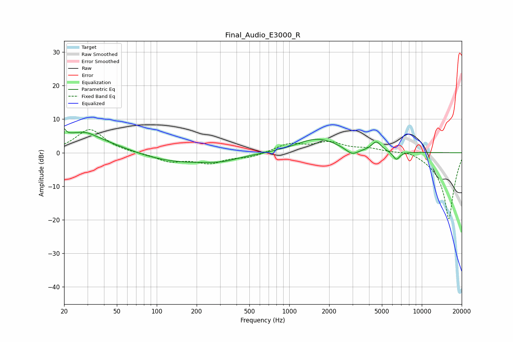

# Final_Audio_E3000_R
See [usage instructions](https://github.com/jaakkopasanen/AutoEq#usage) for more options and info.

### Parametric EQs
Apply preamp of -7.3 dB when using parametric equalizer.

|   # | Type    |   Fc (Hz) |    Q |   Gain (dB) |
|-----|---------|-----------|------|-------------|
|   1 | Peaking |        20 | 6    |         5.3 |
|   2 | Peaking |        20 | 6    |        -3.2 |
|   3 | Peaking |        26 | 0.44 |         5.2 |
|   4 | Peaking |        29 | 1.75 |         1.5 |
|   5 | Peaking |       139 | 0.41 |        -3.3 |
|   6 | Peaking |       312 | 1.31 |        -0.9 |
|   7 | Peaking |      1627 | 0.91 |         4.3 |
|   8 | Peaking |      2978 | 2.92 |        -2.1 |
|   9 | Peaking |      4541 | 3.88 |         2.9 |
|  10 | Peaking |      6431 | 5.32 |        -2.5 |

### Fixed Band EQs
When using fixed band (also called graphic) equalizer, apply preamp of **-7.0 dB** (if available) and set gains manually with these parameters.

|   # | Type    |   Fc (Hz) |    Q |   Gain (dB) |
|-----|---------|-----------|------|-------------|
|   1 | Peaking |        31 | 1.41 |         7   |
|   2 | Peaking |        62 | 1.41 |        -0.1 |
|   3 | Peaking |       125 | 1.41 |        -2.5 |
|   4 | Peaking |       250 | 1.41 |        -2.8 |
|   5 | Peaking |       500 | 1.41 |        -1.3 |
|   6 | Peaking |      1000 | 1.41 |         2.5 |
|   7 | Peaking |      2000 | 1.41 |         2.8 |
|   8 | Peaking |      4000 | 1.41 |         1.1 |
|   9 | Peaking |      8000 | 1.41 |         1.1 |
|  10 | Peaking |     16000 | 1.41 |       -20   |

### Graphs

