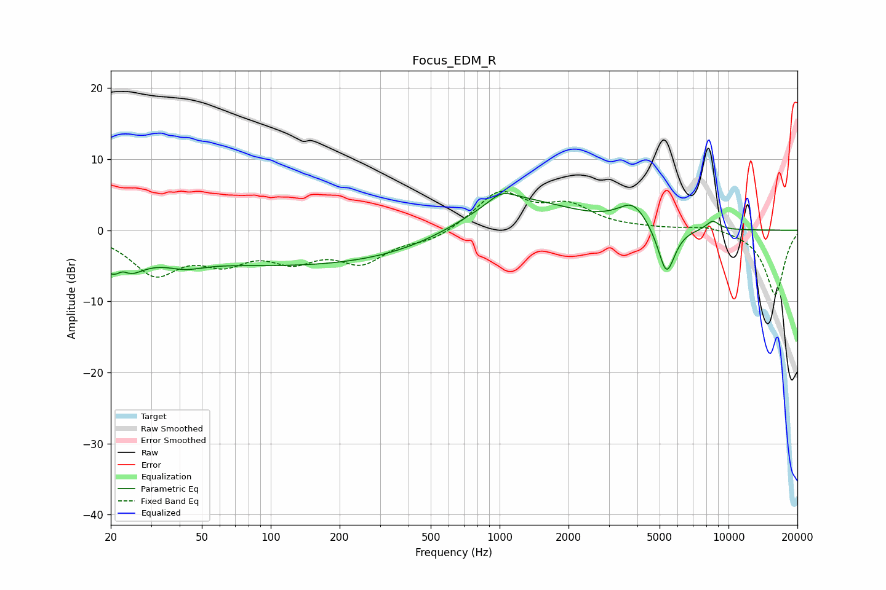

# Focus_EDM_R
See [usage instructions](https://github.com/jaakkopasanen/AutoEq#usage) for more options and info.

### Parametric EQs
Apply preamp of -5.3 dB when using parametric equalizer.

|   # | Type    |   Fc (Hz) |    Q |   Gain (dB) |
|-----|---------|-----------|------|-------------|
|   1 | Peaking |        22 | 1.93 |        -5.7 |
|   2 | Peaking |        22 | 4.66 |         2.1 |
|   3 | Peaking |        42 | 1.74 |        -1.2 |
|   4 | Peaking |       148 | 0.18 |        -5.1 |
|   5 | Peaking |       717 | 1.04 |         0.1 |
|   6 | Peaking |      1020 | 2.5  |         1.5 |
|   7 | Peaking |      1109 | 0.57 |         5.5 |
|   8 | Peaking |      3830 | 2.16 |         3.2 |
|   9 | Peaking |      5359 | 3.65 |        -7   |
|  10 | Peaking |      8525 | 4.38 |         1.3 |

### Fixed Band EQs
When using fixed band (also called graphic) equalizer, apply preamp of **-5.6 dB** (if available) and set gains manually with these parameters.

|   # | Type    |   Fc (Hz) |    Q |   Gain (dB) |
|-----|---------|-----------|------|-------------|
|   1 | Peaking |        31 | 1.41 |        -5.8 |
|   2 | Peaking |        62 | 1.41 |        -3.6 |
|   3 | Peaking |       125 | 1.41 |        -3.5 |
|   4 | Peaking |       250 | 1.41 |        -4.1 |
|   5 | Peaking |       500 | 1.41 |        -1.4 |
|   6 | Peaking |      1000 | 1.41 |         5.3 |
|   7 | Peaking |      2000 | 1.41 |         3.1 |
|   8 | Peaking |      4000 | 1.41 |         0.2 |
|   9 | Peaking |      8000 | 1.41 |         0.7 |
|  10 | Peaking |     16000 | 1.41 |        -9.1 |

### Graphs

