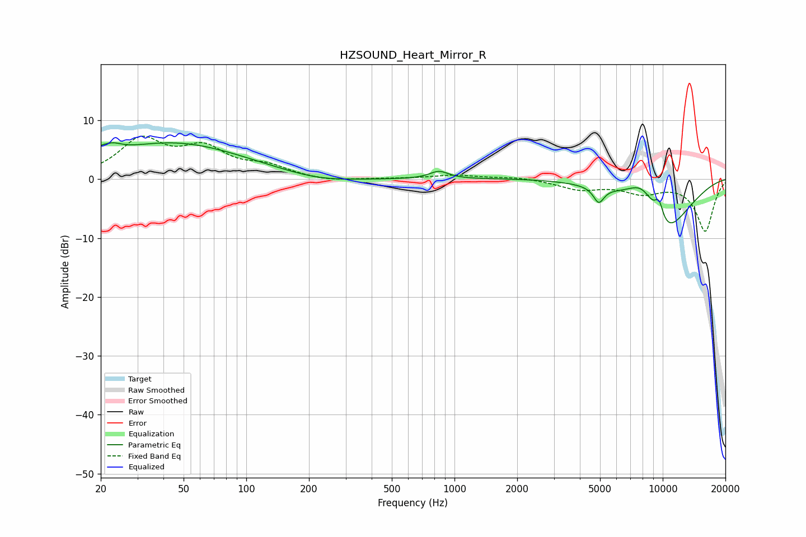

# HZSOUND_Heart_Mirror_R
See [usage instructions](https://github.com/jaakkopasanen/AutoEq#usage) for more options and info.

### Parametric EQs
Apply preamp of -6.3 dB when using parametric equalizer.

|   # | Type    |   Fc (Hz) |    Q |   Gain (dB) |
|-----|---------|-----------|------|-------------|
|   1 | Peaking |        20 | 5.79 |         0.8 |
|   2 | Peaking |        23 | 3.13 |         1.4 |
|   3 | Peaking |        44 | 0.4  |         6.2 |
|   4 | Peaking |       224 | 0.82 |        -1   |
|   5 | Peaking |       842 | 3.14 |         1.3 |
|   6 | Peaking |      4928 | 5.55 |        -2.6 |
|   7 | Peaking |      8034 | 1.67 |         5.5 |
|   8 | Peaking |      9039 | 0.18 |         0.6 |
|   9 | Peaking |      9597 | 5.57 |         3.4 |
|  10 | Peaking |     10000 | 0.89 |       -11.1 |

### Fixed Band EQs
When using fixed band (also called graphic) equalizer, apply preamp of **-7.4 dB** (if available) and set gains manually with these parameters.

|   # | Type    |   Fc (Hz) |    Q |   Gain (dB) |
|-----|---------|-----------|------|-------------|
|   1 | Peaking |        31 | 1.41 |         6.4 |
|   2 | Peaking |        62 | 1.41 |         4.6 |
|   3 | Peaking |       125 | 1.41 |         1.9 |
|   4 | Peaking |       250 | 1.41 |        -0.5 |
|   5 | Peaking |       500 | 1.41 |         0   |
|   6 | Peaking |      1000 | 1.41 |         0.7 |
|   7 | Peaking |      2000 | 1.41 |         0.4 |
|   8 | Peaking |      4000 | 1.41 |        -1.6 |
|   9 | Peaking |      8000 | 1.41 |        -2.1 |
|  10 | Peaking |     16000 | 1.41 |        -8.8 |

### Graphs

