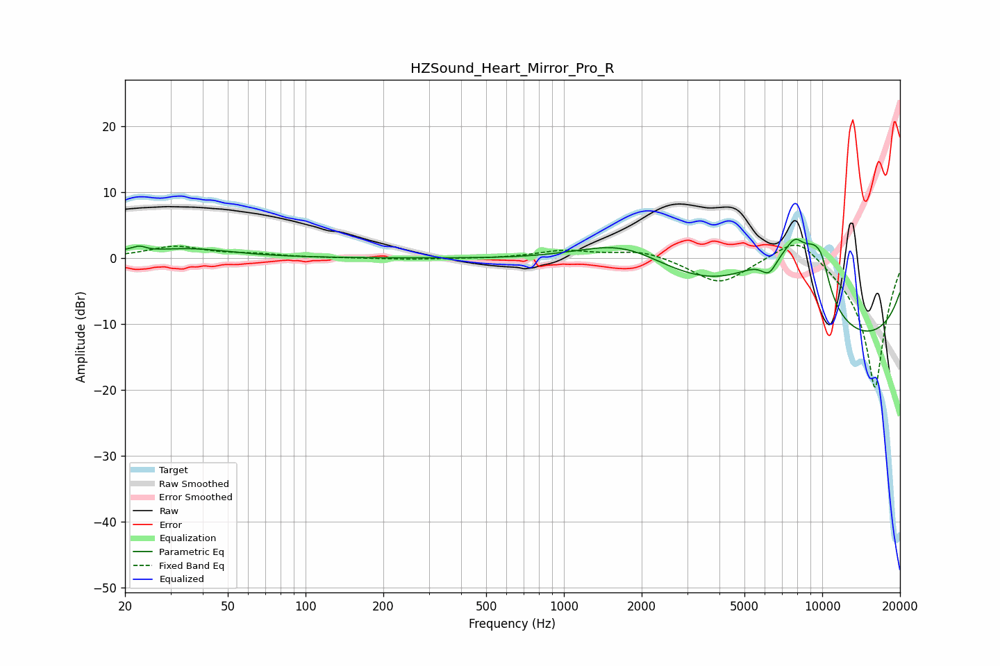

# HZSound_Heart_Mirror_Pro_R
See [usage instructions](https://github.com/jaakkopasanen/AutoEq#usage) for more options and info.

### Parametric EQs
Apply preamp of -3.0 dB when using parametric equalizer.

|   # | Type    |   Fc (Hz) |    Q |   Gain (dB) |
|-----|---------|-----------|------|-------------|
|   1 | Peaking |        20 | 3.19 |         0.5 |
|   2 | Peaking |        23 | 5.73 |         0.6 |
|   3 | Peaking |        35 | 0.86 |         1.4 |
|   4 | Peaking |      1724 | 0.72 |         5.8 |
|   5 | Peaking |      6226 | 4.18 |        -2.9 |
|   6 | Peaking |      6619 | 0.79 |        12.6 |
|   7 | Peaking |      7852 | 3.5  |         3.4 |
|   8 | Peaking |      9250 | 2.36 |         6   |
|   9 | Peaking |      9972 | 3.98 |         3.3 |
|  10 | Peaking |     10000 | 0.19 |       -15.5 |

### Fixed Band EQs
When using fixed band (also called graphic) equalizer, apply preamp of **-2.1 dB** (if available) and set gains manually with these parameters.

|   # | Type    |   Fc (Hz) |    Q |   Gain (dB) |
|-----|---------|-----------|------|-------------|
|   1 | Peaking |        31 | 1.41 |         1.7 |
|   2 | Peaking |        62 | 1.41 |         0.5 |
|   3 | Peaking |       125 | 1.41 |         0   |
|   4 | Peaking |       250 | 1.41 |        -0.2 |
|   5 | Peaking |       500 | 1.41 |        -0.1 |
|   6 | Peaking |      1000 | 1.41 |         1.1 |
|   7 | Peaking |      2000 | 1.41 |         1.2 |
|   8 | Peaking |      4000 | 1.41 |        -3.9 |
|   9 | Peaking |      8000 | 1.41 |         4.3 |
|  10 | Peaking |     16000 | 1.41 |       -20   |

### Graphs

