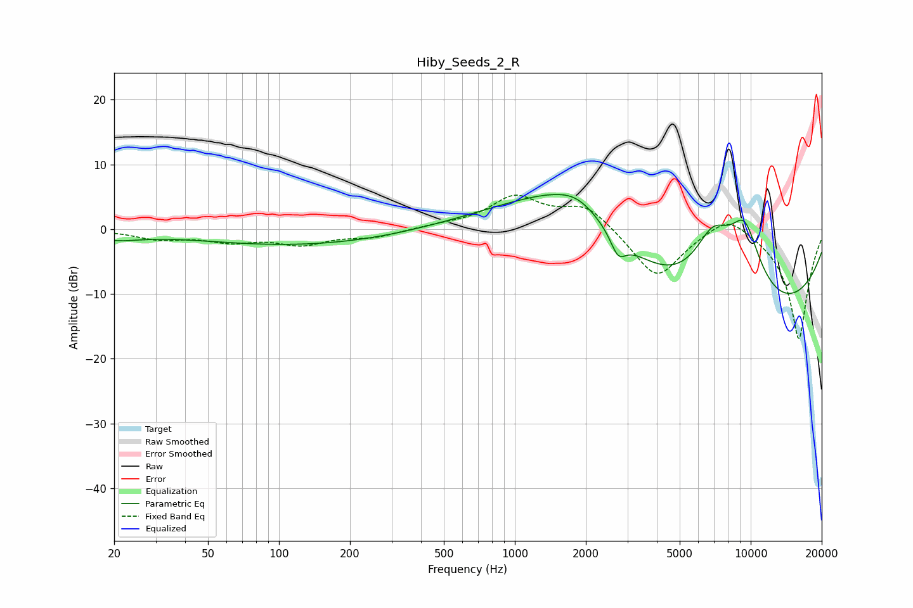

# Hiby_Seeds_2_R
See [usage instructions](https://github.com/jaakkopasanen/AutoEq#usage) for more options and info.

### Parametric EQs
Apply preamp of -5.4 dB when using parametric equalizer.

|   # | Type    |   Fc (Hz) |    Q |   Gain (dB) |
|-----|---------|-----------|------|-------------|
|   1 | Peaking |        20 | 1.26 |        -1.2 |
|   2 | Peaking |       144 | 0.28 |        -2.7 |
|   3 | Peaking |       714 | 0.34 |         1.2 |
|   4 | Peaking |      1715 | 0.49 |         9.1 |
|   5 | Peaking |      1759 | 0.54 |         2.4 |
|   6 | Peaking |      1836 | 1.69 |         1.5 |
|   7 | Peaking |      2741 | 4.34 |        -3.2 |
|   8 | Peaking |      6914 | 1.33 |        11.2 |
|   9 | Peaking |      7657 | 0.23 |       -19.2 |
|  10 | Peaking |      9414 | 1.46 |        13.3 |

### Fixed Band EQs
When using fixed band (also called graphic) equalizer, apply preamp of **-5.3 dB** (if available) and set gains manually with these parameters.

|   # | Type    |   Fc (Hz) |    Q |   Gain (dB) |
|-----|---------|-----------|------|-------------|
|   1 | Peaking |        31 | 1.41 |        -1.4 |
|   2 | Peaking |        62 | 1.41 |        -1.6 |
|   3 | Peaking |       125 | 1.41 |        -2.1 |
|   4 | Peaking |       250 | 1.41 |        -1.1 |
|   5 | Peaking |       500 | 1.41 |         0.5 |
|   6 | Peaking |      1000 | 1.41 |         4.8 |
|   7 | Peaking |      2000 | 1.41 |         3.8 |
|   8 | Peaking |      4000 | 1.41 |        -7.8 |
|   9 | Peaking |      8000 | 1.41 |         3.1 |
|  10 | Peaking |     16000 | 1.41 |       -17.1 |

### Graphs

