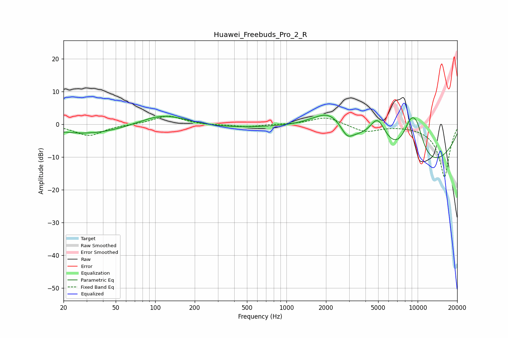

# Huawei_Freebuds_Pro_2_R
See [usage instructions](https://github.com/jaakkopasanen/AutoEq#usage) for more options and info.

### Parametric EQs
Apply preamp of -2.9 dB when using parametric equalizer.

|   # | Type    |   Fc (Hz) |    Q |   Gain (dB) |
|-----|---------|-----------|------|-------------|
|   1 | Peaking |        32 | 0.38 |         0.7 |
|   2 | Peaking |        32 | 0.46 |        -3.8 |
|   3 | Peaking |       115 | 0.75 |         3.9 |
|   4 | Peaking |       295 | 0.48 |        -1.2 |
|   5 | Peaking |      2158 | 0.9  |         9.3 |
|   6 | Peaking |      2895 | 3.02 |        -3.5 |
|   7 | Peaking |      4954 | 1.83 |        10.6 |
|   8 | Peaking |      8634 | 0.29 |       -17.7 |
|   9 | Peaking |      8759 | 1.68 |        11.5 |
|  10 | Peaking |      9817 | 2.12 |         8.2 |

### Fixed Band EQs
When using fixed band (also called graphic) equalizer, apply preamp of **-2.6 dB** (if available) and set gains manually with these parameters.

|   # | Type    |   Fc (Hz) |    Q |   Gain (dB) |
|-----|---------|-----------|------|-------------|
|   1 | Peaking |        31 | 1.41 |        -3.5 |
|   2 | Peaking |        62 | 1.41 |        -0   |
|   3 | Peaking |       125 | 1.41 |         2.7 |
|   4 | Peaking |       250 | 1.41 |        -0.3 |
|   5 | Peaking |       500 | 1.41 |        -0.8 |
|   6 | Peaking |      1000 | 1.41 |        -0   |
|   7 | Peaking |      2000 | 1.41 |         2.4 |
|   8 | Peaking |      4000 | 1.41 |        -2.3 |
|   9 | Peaking |      8000 | 1.41 |        -0   |
|  10 | Peaking |     16000 | 1.41 |       -16.2 |

### Graphs

