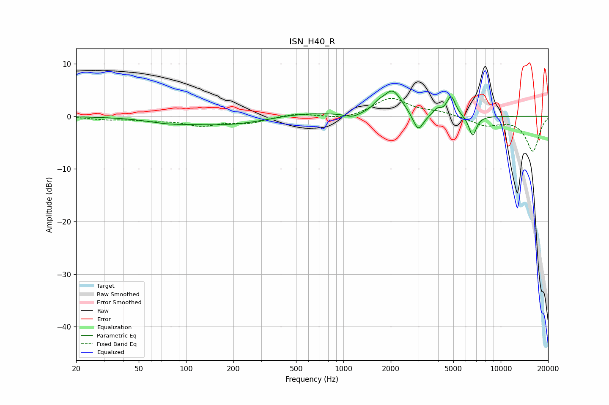

# ISN_H40_R
See [usage instructions](https://github.com/jaakkopasanen/AutoEq#usage) for more options and info.

### Parametric EQs
Apply preamp of -4.9 dB when using parametric equalizer.

|   # | Type    |   Fc (Hz) |    Q |   Gain (dB) |
|-----|---------|-----------|------|-------------|
|   1 | Peaking |        76 | 1.04 |        -0.7 |
|   2 | Peaking |       189 | 0.54 |        -1.7 |
|   3 | Peaking |       536 | 0.65 |         0.9 |
|   4 | Peaking |      1140 | 3.14 |        -0.8 |
|   5 | Peaking |      1664 | 4.47 |         0.9 |
|   6 | Peaking |      2050 | 2.34 |         4.8 |
|   7 | Peaking |      2988 | 4.27 |        -3.5 |
|   8 | Peaking |      3945 | 6    |         1.1 |
|   9 | Peaking |      4836 | 5.04 |         3.8 |
|  10 | Peaking |      6628 | 5.56 |        -3.9 |

### Fixed Band EQs
When using fixed band (also called graphic) equalizer, apply preamp of **-3.5 dB** (if available) and set gains manually with these parameters.

|   # | Type    |   Fc (Hz) |    Q |   Gain (dB) |
|-----|---------|-----------|------|-------------|
|   1 | Peaking |        31 | 1.41 |        -0.5 |
|   2 | Peaking |        62 | 1.41 |        -0.6 |
|   3 | Peaking |       125 | 1.41 |        -1.6 |
|   4 | Peaking |       250 | 1.41 |        -1.1 |
|   5 | Peaking |       500 | 1.41 |         0.6 |
|   6 | Peaking |      1000 | 1.41 |        -0.7 |
|   7 | Peaking |      2000 | 1.41 |         3.5 |
|   8 | Peaking |      4000 | 1.41 |         0.8 |
|   9 | Peaking |      8000 | 1.41 |        -1.7 |
|  10 | Peaking |     16000 | 1.41 |        -6.6 |

### Graphs

