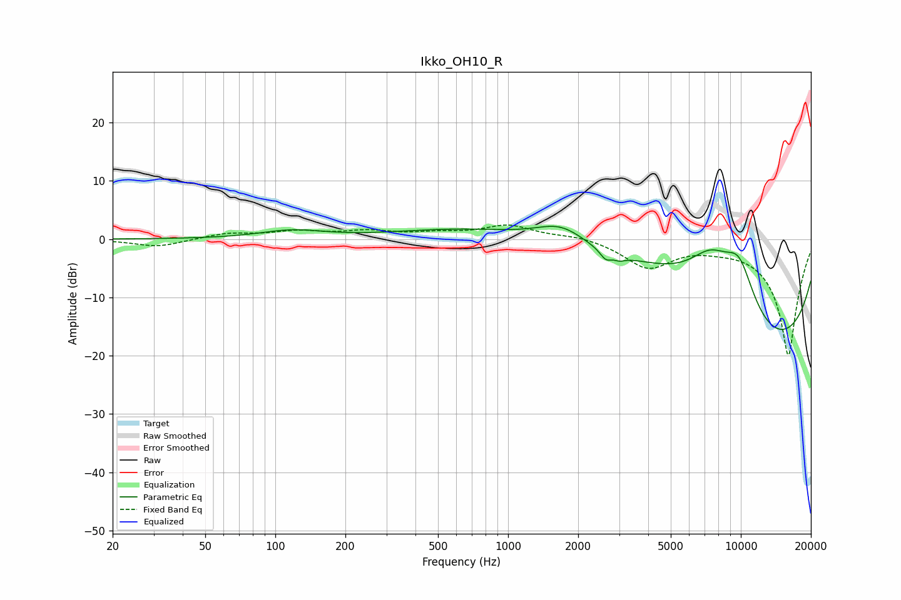

# Ikko_OH10_R
See [usage instructions](https://github.com/jaakkopasanen/AutoEq#usage) for more options and info.

### Parametric EQs
Apply preamp of -2.3 dB when using parametric equalizer.

|   # | Type    |   Fc (Hz) |    Q |   Gain (dB) |
|-----|---------|-----------|------|-------------|
|   1 | Peaking |       117 | 1.03 |         1.4 |
|   2 | Peaking |      1696 | 1.27 |         3.7 |
|   3 | Peaking |      1797 | 0.26 |         5.5 |
|   4 | Peaking |      2627 | 5.75 |        -1.5 |
|   5 | Peaking |      3011 | 5.76 |        -0.7 |
|   6 | Peaking |      4425 | 0.52 |         6.4 |
|   7 | Peaking |      7405 | 1.15 |         9.1 |
|   8 | Peaking |      8709 | 0.19 |        -4.2 |
|   9 | Peaking |      9272 | 0.18 |       -18.3 |
|  10 | Peaking |      9827 | 1.57 |         9.9 |

### Fixed Band EQs
When using fixed band (also called graphic) equalizer, apply preamp of **-2.5 dB** (if available) and set gains manually with these parameters.

|   # | Type    |   Fc (Hz) |    Q |   Gain (dB) |
|-----|---------|-----------|------|-------------|
|   1 | Peaking |        31 | 1.41 |        -1.3 |
|   2 | Peaking |        62 | 1.41 |         1   |
|   3 | Peaking |       125 | 1.41 |         1.2 |
|   4 | Peaking |       250 | 1.41 |         1.2 |
|   5 | Peaking |       500 | 1.41 |         0.8 |
|   6 | Peaking |      1000 | 1.41 |         2.3 |
|   7 | Peaking |      2000 | 1.41 |         0.7 |
|   8 | Peaking |      4000 | 1.41 |        -4.7 |
|   9 | Peaking |      8000 | 1.41 |        -0.6 |
|  10 | Peaking |     16000 | 1.41 |       -20   |

### Graphs

