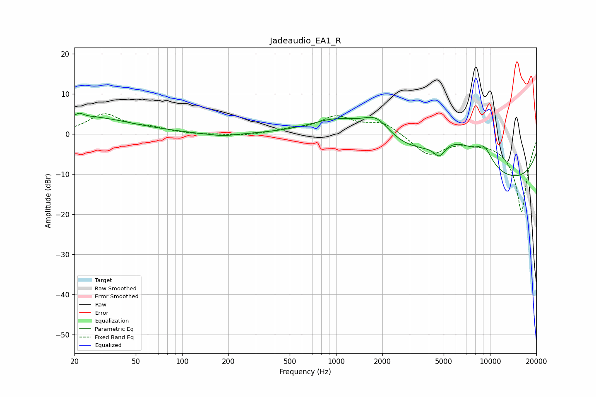

# Jadeaudio_EA1_R
See [usage instructions](https://github.com/jaakkopasanen/AutoEq#usage) for more options and info.

### Parametric EQs
Apply preamp of -5.3 dB when using parametric equalizer.

|   # | Type    |   Fc (Hz) |    Q |   Gain (dB) |
|-----|---------|-----------|------|-------------|
|   1 | Peaking |        22 | 5.95 |         0.9 |
|   2 | Peaking |        23 | 0.47 |         4.4 |
|   3 | Peaking |       162 | 1.79 |         0.8 |
|   4 | Peaking |       169 | 1.45 |        -1.6 |
|   5 | Peaking |      1049 | 0.68 |         6.9 |
|   6 | Peaking |      1831 | 1.47 |         5.7 |
|   7 | Peaking |      4687 | 3.94 |        -2.9 |
|   8 | Peaking |      6109 | 0.54 |        14.2 |
|   9 | Peaking |      8068 | 0.18 |       -18   |
|  10 | Peaking |      9179 | 2.41 |         4.3 |

### Fixed Band EQs
When using fixed band (also called graphic) equalizer, apply preamp of **-5.2 dB** (if available) and set gains manually with these parameters.

|   # | Type    |   Fc (Hz) |    Q |   Gain (dB) |
|-----|---------|-----------|------|-------------|
|   1 | Peaking |        31 | 1.41 |         4.8 |
|   2 | Peaking |        62 | 1.41 |         1.2 |
|   3 | Peaking |       125 | 1.41 |        -0.2 |
|   4 | Peaking |       250 | 1.41 |        -0.5 |
|   5 | Peaking |       500 | 1.41 |         0.9 |
|   6 | Peaking |      1000 | 1.41 |         4.1 |
|   7 | Peaking |      2000 | 1.41 |         2.9 |
|   8 | Peaking |      4000 | 1.41 |        -5.1 |
|   9 | Peaking |      8000 | 1.41 |        -0.8 |
|  10 | Peaking |     16000 | 1.41 |       -19.4 |

### Graphs

