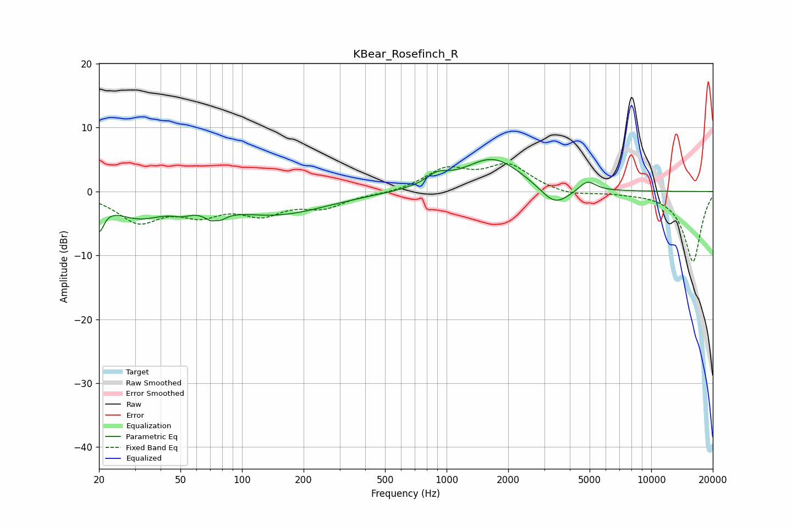

# KBear_Rosefinch_R
See [usage instructions](https://github.com/jaakkopasanen/AutoEq#usage) for more options and info.

### Parametric EQs
Apply preamp of -5.1 dB when using parametric equalizer.

|   # | Type    |   Fc (Hz) |    Q |   Gain (dB) |
|-----|---------|-----------|------|-------------|
|   1 | Peaking |        20 | 5.98 |        -4.2 |
|   2 | Peaking |        31 | 1.07 |        -3.5 |
|   3 | Peaking |        51 | 2.83 |        -1   |
|   4 | Peaking |        74 | 4.26 |        -4.1 |
|   5 | Peaking |        74 | 6    |         2.4 |
|   6 | Peaking |       148 | 0.57 |        -3.5 |
|   7 | Peaking |       899 | 2.58 |         1.6 |
|   8 | Peaking |      1685 | 0.99 |         5.3 |
|   9 | Peaking |      3377 | 1.96 |        -3.1 |
|  10 | Peaking |      4876 | 3.42 |         1.7 |

### Fixed Band EQs
When using fixed band (also called graphic) equalizer, apply preamp of **-4.5 dB** (if available) and set gains manually with these parameters.

|   # | Type    |   Fc (Hz) |    Q |   Gain (dB) |
|-----|---------|-----------|------|-------------|
|   1 | Peaking |        31 | 1.41 |        -4.4 |
|   2 | Peaking |        62 | 1.41 |        -3   |
|   3 | Peaking |       125 | 1.41 |        -3.1 |
|   4 | Peaking |       250 | 1.41 |        -2.2 |
|   5 | Peaking |       500 | 1.41 |        -0.3 |
|   6 | Peaking |      1000 | 1.41 |         3.3 |
|   7 | Peaking |      2000 | 1.41 |         3.9 |
|   8 | Peaking |      4000 | 1.41 |        -0.7 |
|   9 | Peaking |      8000 | 1.41 |        -0.1 |
|  10 | Peaking |     16000 | 1.41 |       -11   |

### Graphs

