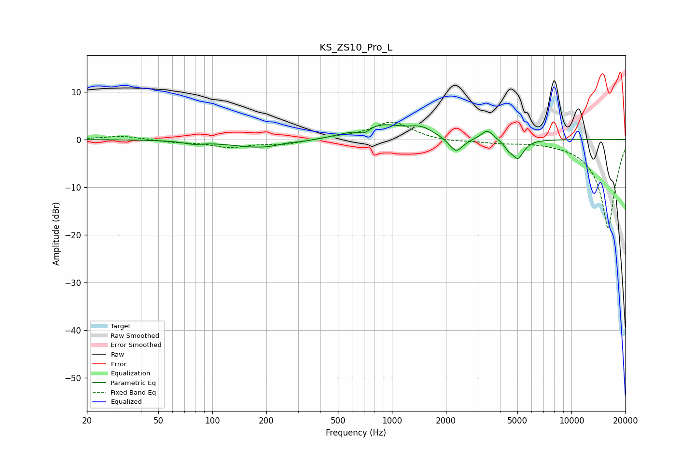

# KS_ZS10_Pro_L
See [usage instructions](https://github.com/jaakkopasanen/AutoEq#usage) for more options and info.

### Parametric EQs
Apply preamp of -3.2 dB when using parametric equalizer.

|   # | Type    |   Fc (Hz) |    Q |   Gain (dB) |
|-----|---------|-----------|------|-------------|
|   1 | Peaking |        78 | 2.66 |        -0.6 |
|   2 | Peaking |       193 | 0.82 |        -1.8 |
|   3 | Peaking |       257 | 2.63 |         0.4 |
|   4 | Peaking |       702 | 4.27 |        -1.3 |
|   5 | Peaking |       841 | 0.99 |         3.3 |
|   6 | Peaking |      1461 | 2.16 |         1.7 |
|   7 | Peaking |      2276 | 3.67 |        -3.1 |
|   8 | Peaking |      3397 | 4.21 |         2.1 |
|   9 | Peaking |      4449 | 5.99 |        -1.2 |
|  10 | Peaking |      5030 | 4.4  |        -3.8 |

### Fixed Band EQs
When using fixed band (also called graphic) equalizer, apply preamp of **-3.7 dB** (if available) and set gains manually with these parameters.

|   # | Type    |   Fc (Hz) |    Q |   Gain (dB) |
|-----|---------|-----------|------|-------------|
|   1 | Peaking |        31 | 1.41 |         0.8 |
|   2 | Peaking |        62 | 1.41 |        -0.5 |
|   3 | Peaking |       125 | 1.41 |        -1.5 |
|   4 | Peaking |       250 | 1.41 |        -0.9 |
|   5 | Peaking |       500 | 1.41 |         0.4 |
|   6 | Peaking |      1000 | 1.41 |         3.7 |
|   7 | Peaking |      2000 | 1.41 |        -0.5 |
|   8 | Peaking |      4000 | 1.41 |        -0.6 |
|   9 | Peaking |      8000 | 1.41 |        -0.2 |
|  10 | Peaking |     16000 | 1.41 |       -18.8 |

### Graphs

