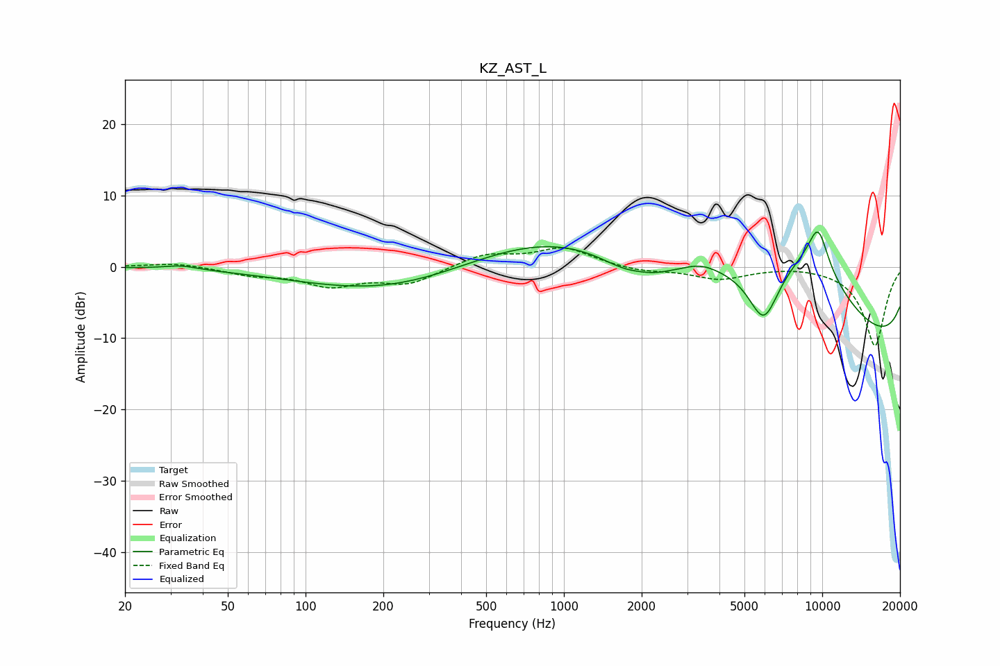

# KZ_AST_L
See [usage instructions](https://github.com/jaakkopasanen/AutoEq#usage) for more options and info.

### Parametric EQs
Apply preamp of -5.0 dB when using parametric equalizer.

|   # | Type    |   Fc (Hz) |    Q |   Gain (dB) |
|-----|---------|-----------|------|-------------|
|   1 | Peaking |        33 | 2.26 |         0.5 |
|   2 | Peaking |       262 | 0.38 |        -5.3 |
|   3 | Peaking |      1728 | 0.19 |         9.3 |
|   4 | Peaking |      1927 | 1.16 |        -4.3 |
|   5 | Peaking |      1947 | 2.3  |         0.8 |
|   6 | Peaking |      3396 | 2.14 |         0.8 |
|   7 | Peaking |      5941 | 2.24 |        -8.1 |
|   8 | Peaking |      8851 | 0.52 |        13.5 |
|   9 | Peaking |      9641 | 3.12 |         5.9 |
|  10 | Peaking |     10000 | 0.18 |       -17   |

### Fixed Band EQs
When using fixed band (also called graphic) equalizer, apply preamp of **-2.8 dB** (if available) and set gains manually with these parameters.

|   # | Type    |   Fc (Hz) |    Q |   Gain (dB) |
|-----|---------|-----------|------|-------------|
|   1 | Peaking |        31 | 1.41 |         0.6 |
|   2 | Peaking |        62 | 1.41 |        -1   |
|   3 | Peaking |       125 | 1.41 |        -2.5 |
|   4 | Peaking |       250 | 1.41 |        -2.3 |
|   5 | Peaking |       500 | 1.41 |         1.8 |
|   6 | Peaking |      1000 | 1.41 |         2.6 |
|   7 | Peaking |      2000 | 1.41 |        -0.6 |
|   8 | Peaking |      4000 | 1.41 |        -1.6 |
|   9 | Peaking |      8000 | 1.41 |         0.2 |
|  10 | Peaking |     16000 | 1.41 |       -11.1 |

### Graphs

