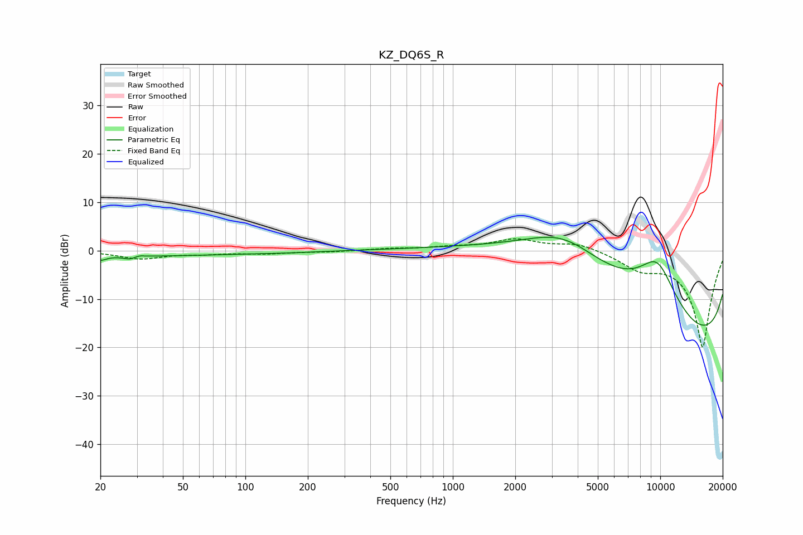

# KZ_DQ6S_R
See [usage instructions](https://github.com/jaakkopasanen/AutoEq#usage) for more options and info.

### Parametric EQs
Apply preamp of -2.9 dB when using parametric equalizer.

|   # | Type    |   Fc (Hz) |    Q |   Gain (dB) |
|-----|---------|-----------|------|-------------|
|   1 | Peaking |        20 | 5.27 |        -0.9 |
|   2 | Peaking |        28 | 0.26 |        -1.1 |
|   3 | Peaking |        28 | 4.62 |        -0.7 |
|   4 | Peaking |        31 | 5.98 |         0.4 |
|   5 | Peaking |       159 | 0.93 |        -0.2 |
|   6 | Peaking |      3437 | 0.63 |         9.4 |
|   7 | Peaking |      4516 | 0.24 |         9.8 |
|   8 | Peaking |      9661 | 1.03 |        13.6 |
|   9 | Peaking |     10000 | 0.18 |       -19.1 |
|  10 | Peaking |     10000 | 0.18 |        -7   |

### Fixed Band EQs
When using fixed band (also called graphic) equalizer, apply preamp of **-2.5 dB** (if available) and set gains manually with these parameters.

|   # | Type    |   Fc (Hz) |    Q |   Gain (dB) |
|-----|---------|-----------|------|-------------|
|   1 | Peaking |        31 | 1.41 |        -1.6 |
|   2 | Peaking |        62 | 1.41 |        -0.5 |
|   3 | Peaking |       125 | 1.41 |        -0.5 |
|   4 | Peaking |       250 | 1.41 |        -0.2 |
|   5 | Peaking |       500 | 1.41 |         0.4 |
|   6 | Peaking |      1000 | 1.41 |         0.6 |
|   7 | Peaking |      2000 | 1.41 |         2.2 |
|   8 | Peaking |      4000 | 1.41 |         1.6 |
|   9 | Peaking |      8000 | 1.41 |        -3   |
|  10 | Peaking |     16000 | 1.41 |       -20   |

### Graphs

