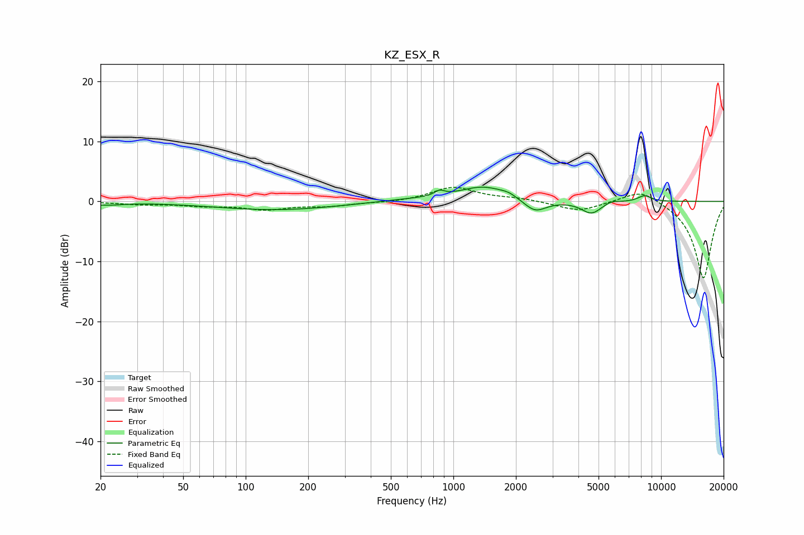

# KZ_ESX_R
See [usage instructions](https://github.com/jaakkopasanen/AutoEq#usage) for more options and info.

### Parametric EQs
Apply preamp of -2.5 dB when using parametric equalizer.

|   # | Type    |   Fc (Hz) |    Q |   Gain (dB) |
|-----|---------|-----------|------|-------------|
|   1 | Peaking |        21 | 1.82 |        -0.5 |
|   2 | Peaking |       141 | 0.47 |        -1.4 |
|   3 | Peaking |       633 | 0.75 |         0.4 |
|   4 | Peaking |       857 | 5.99 |         0.8 |
|   5 | Peaking |      1396 | 1.22 |         2.4 |
|   6 | Peaking |      1842 | 3.69 |         0.5 |
|   7 | Peaking |      2473 | 2.6  |        -2.1 |
|   8 | Peaking |      4624 | 2.91 |        -2.1 |
|   9 | Peaking |      5744 | 3.91 |         0.5 |
|  10 | Peaking |      8325 | 3.96 |         1   |

### Fixed Band EQs
When using fixed band (also called graphic) equalizer, apply preamp of **-2.4 dB** (if available) and set gains manually with these parameters.

|   # | Type    |   Fc (Hz) |    Q |   Gain (dB) |
|-----|---------|-----------|------|-------------|
|   1 | Peaking |        31 | 1.41 |        -0.4 |
|   2 | Peaking |        62 | 1.41 |        -0.6 |
|   3 | Peaking |       125 | 1.41 |        -1.2 |
|   4 | Peaking |       250 | 1.41 |        -0.7 |
|   5 | Peaking |       500 | 1.41 |        -0.2 |
|   6 | Peaking |      1000 | 1.41 |         2.4 |
|   7 | Peaking |      2000 | 1.41 |         0.5 |
|   8 | Peaking |      4000 | 1.41 |        -1.6 |
|   9 | Peaking |      8000 | 1.41 |         2.2 |
|  10 | Peaking |     16000 | 1.41 |       -12.9 |

### Graphs

