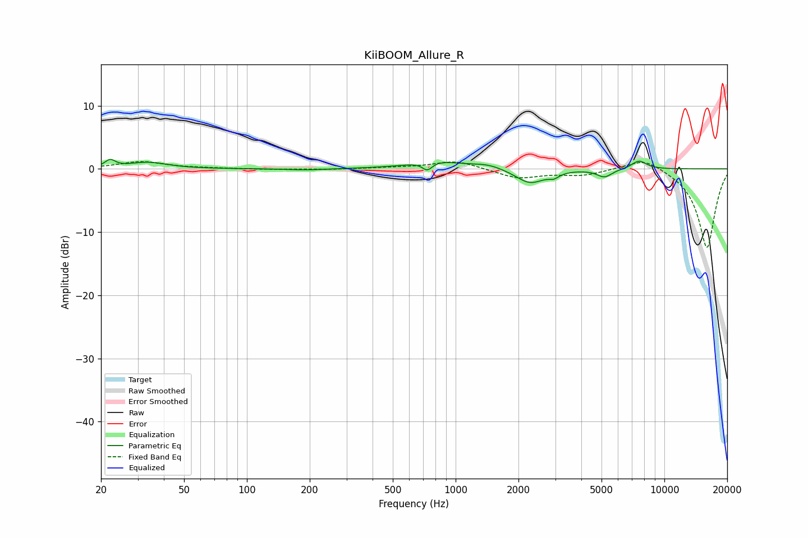

# KiiBOOM_Allure_R
See [usage instructions](https://github.com/jaakkopasanen/AutoEq#usage) for more options and info.

### Parametric EQs
Apply preamp of -1.6 dB when using parametric equalizer.

|   # | Type    |   Fc (Hz) |    Q |   Gain (dB) |
|-----|---------|-----------|------|-------------|
|   1 | Peaking |        22 | 6    |         1.1 |
|   2 | Peaking |        34 | 1.58 |         1   |
|   3 | Peaking |       193 | 1.56 |        -0.2 |
|   4 | Peaking |       732 | 6    |        -1.3 |
|   5 | Peaking |       809 | 1.14 |         1.2 |
|   6 | Peaking |      1432 | 1.92 |         0.7 |
|   7 | Peaking |      2273 | 2.04 |        -2.4 |
|   8 | Peaking |      2956 | 5.85 |        -0.7 |
|   9 | Peaking |      5164 | 3.88 |        -1.3 |
|  10 | Peaking |      7563 | 3.7  |         1.3 |

### Fixed Band EQs
When using fixed band (also called graphic) equalizer, apply preamp of **-1.2 dB** (if available) and set gains manually with these parameters.

|   # | Type    |   Fc (Hz) |    Q |   Gain (dB) |
|-----|---------|-----------|------|-------------|
|   1 | Peaking |        31 | 1.41 |         1.1 |
|   2 | Peaking |        62 | 1.41 |         0.1 |
|   3 | Peaking |       125 | 1.41 |        -0.1 |
|   4 | Peaking |       250 | 1.41 |        -0.1 |
|   5 | Peaking |       500 | 1.41 |         0.2 |
|   6 | Peaking |      1000 | 1.41 |         1.3 |
|   7 | Peaking |      2000 | 1.41 |        -1.5 |
|   8 | Peaking |      4000 | 1.41 |        -0.9 |
|   9 | Peaking |      8000 | 1.41 |         2   |
|  10 | Peaking |     16000 | 1.41 |       -12.6 |

### Graphs

