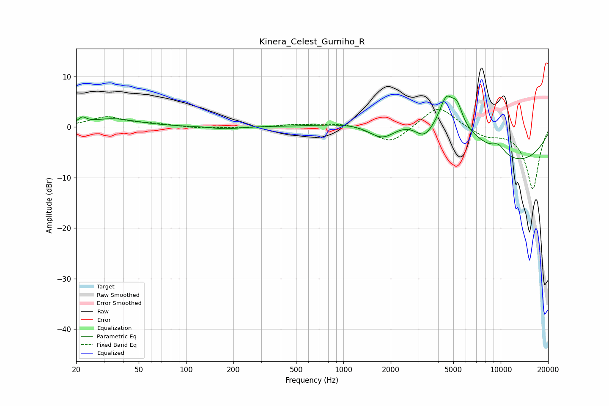

# Kinera_Celest_Gumiho_R
See [usage instructions](https://github.com/jaakkopasanen/AutoEq#usage) for more options and info.

### Parametric EQs
Apply preamp of -6.2 dB when using parametric equalizer.

|   # | Type    |   Fc (Hz) |    Q |   Gain (dB) |
|-----|---------|-----------|------|-------------|
|   1 | Peaking |        22 | 6    |         1.1 |
|   2 | Peaking |        34 | 0.93 |         1.6 |
|   3 | Peaking |       177 | 1.78 |        -0.5 |
|   4 | Peaking |      1778 | 1.5  |        -3.9 |
|   5 | Peaking |      3276 | 2.15 |        -3.9 |
|   6 | Peaking |      4508 | 3.46 |         5.1 |
|   7 | Peaking |      4558 | 0.39 |         8.1 |
|   8 | Peaking |      5273 | 4.04 |         3.7 |
|   9 | Peaking |      9690 | 3.03 |         1.8 |
|  10 | Peaking |      9728 | 0.32 |       -10.2 |

### Fixed Band EQs
When using fixed band (also called graphic) equalizer, apply preamp of **-3.6 dB** (if available) and set gains manually with these parameters.

|   # | Type    |   Fc (Hz) |    Q |   Gain (dB) |
|-----|---------|-----------|------|-------------|
|   1 | Peaking |        31 | 1.41 |         1.9 |
|   2 | Peaking |        62 | 1.41 |         0.5 |
|   3 | Peaking |       125 | 1.41 |        -0.3 |
|   4 | Peaking |       250 | 1.41 |        -0.1 |
|   5 | Peaking |       500 | 1.41 |         0.5 |
|   6 | Peaking |      1000 | 1.41 |         0.8 |
|   7 | Peaking |      2000 | 1.41 |        -3.4 |
|   8 | Peaking |      4000 | 1.41 |         4.4 |
|   9 | Peaking |      8000 | 1.41 |        -1.7 |
|  10 | Peaking |     16000 | 1.41 |       -12.3 |

### Graphs

