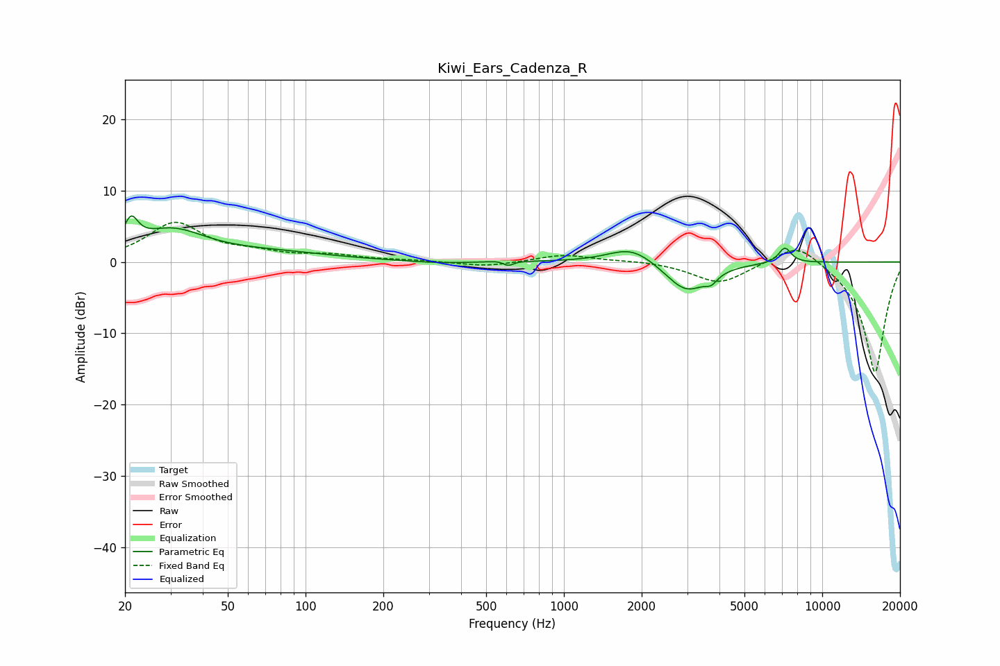

# Kiwi_Ears_Cadenza_R
See [usage instructions](https://github.com/jaakkopasanen/AutoEq#usage) for more options and info.

### Parametric EQs
Apply preamp of -6.5 dB when using parametric equalizer.

|   # | Type    |   Fc (Hz) |    Q |   Gain (dB) |
|-----|---------|-----------|------|-------------|
|   1 | Peaking |        21 | 5.25 |         3.6 |
|   2 | Peaking |        30 | 1.06 |         4.1 |
|   3 | Peaking |        76 | 0.6  |         1.1 |
|   4 | Peaking |       334 | 1.22 |        -0.3 |
|   5 | Peaking |       597 | 4.5  |         0.9 |
|   6 | Peaking |       605 | 5.94 |        -1.4 |
|   7 | Peaking |      1833 | 1.55 |         2.4 |
|   8 | Peaking |      2979 | 1.73 |        -4.3 |
|   9 | Peaking |      3718 | 6    |        -1.1 |
|  10 | Peaking |      7167 | 5.49 |         2.2 |

### Fixed Band EQs
When using fixed band (also called graphic) equalizer, apply preamp of **-5.6 dB** (if available) and set gains manually with these parameters.

|   # | Type    |   Fc (Hz) |    Q |   Gain (dB) |
|-----|---------|-----------|------|-------------|
|   1 | Peaking |        31 | 1.41 |         5.3 |
|   2 | Peaking |        62 | 1.41 |         0.9 |
|   3 | Peaking |       125 | 1.41 |         0.8 |
|   4 | Peaking |       250 | 1.41 |         0.2 |
|   5 | Peaking |       500 | 1.41 |        -0.7 |
|   6 | Peaking |      1000 | 1.41 |         1   |
|   7 | Peaking |      2000 | 1.41 |         0.2 |
|   8 | Peaking |      4000 | 1.41 |        -3   |
|   9 | Peaking |      8000 | 1.41 |         3.1 |
|  10 | Peaking |     16000 | 1.41 |       -15.6 |

### Graphs

