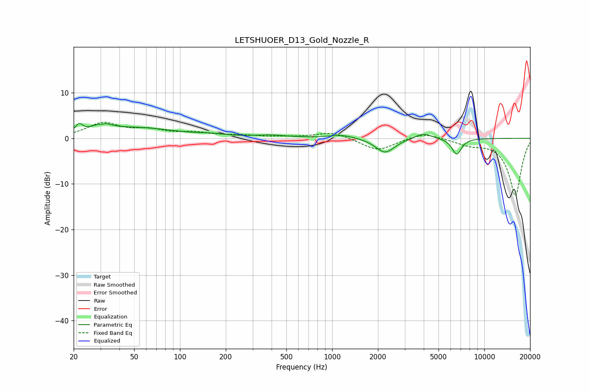

# LETSHUOER_D13_Gold_Nozzle_R
See [usage instructions](https://github.com/jaakkopasanen/AutoEq#usage) for more options and info.

### Parametric EQs
Apply preamp of -3.3 dB when using parametric equalizer.

|   # | Type    |   Fc (Hz) |    Q |   Gain (dB) |
|-----|---------|-----------|------|-------------|
|   1 | Peaking |        22 | 5.98 |         1.8 |
|   2 | Peaking |        30 | 4.65 |        -1.7 |
|   3 | Peaking |        31 | 3.23 |         3   |
|   4 | Peaking |        51 | 0.52 |         2.2 |
|   5 | Peaking |       162 | 1.73 |         0.4 |
|   6 | Peaking |       395 | 1.28 |         0.5 |
|   7 | Peaking |      1168 | 1.61 |         0.8 |
|   8 | Peaking |      2230 | 2.26 |        -3.2 |
|   9 | Peaking |      3976 | 2.53 |         1.3 |
|  10 | Peaking |      6583 | 4.4  |        -3.5 |

### Fixed Band EQs
When using fixed band (also called graphic) equalizer, apply preamp of **-3.6 dB** (if available) and set gains manually with these parameters.

|   # | Type    |   Fc (Hz) |    Q |   Gain (dB) |
|-----|---------|-----------|------|-------------|
|   1 | Peaking |        31 | 1.41 |         3.2 |
|   2 | Peaking |        62 | 1.41 |         1.5 |
|   3 | Peaking |       125 | 1.41 |         1   |
|   4 | Peaking |       250 | 1.41 |         0.5 |
|   5 | Peaking |       500 | 1.41 |         0.2 |
|   6 | Peaking |      1000 | 1.41 |         1.4 |
|   7 | Peaking |      2000 | 1.41 |        -2.8 |
|   8 | Peaking |      4000 | 1.41 |         1.4 |
|   9 | Peaking |      8000 | 1.41 |        -1.2 |
|  10 | Peaking |     16000 | 1.41 |       -12.6 |

### Graphs

