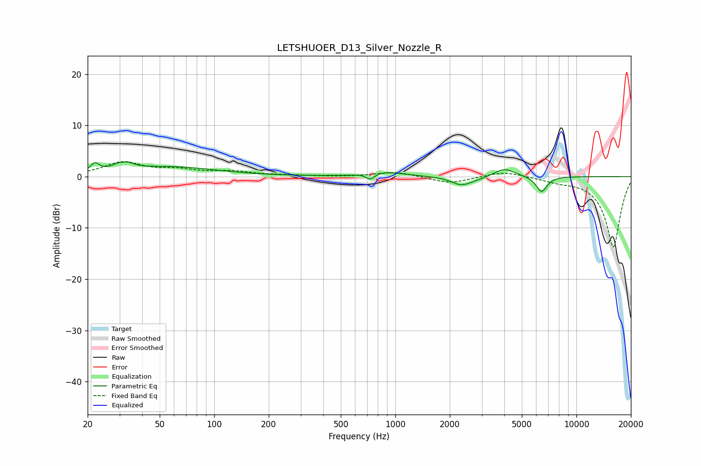

# LETSHUOER_D13_Silver_Nozzle_R
See [usage instructions](https://github.com/jaakkopasanen/AutoEq#usage) for more options and info.

### Parametric EQs
Apply preamp of -3.0 dB when using parametric equalizer.

|   # | Type    |   Fc (Hz) |    Q |   Gain (dB) |
|-----|---------|-----------|------|-------------|
|   1 | Peaking |        22 | 5.99 |         1.7 |
|   2 | Peaking |        31 | 5.42 |        -1.1 |
|   3 | Peaking |        31 | 3.56 |         2.6 |
|   4 | Peaking |        56 | 0.55 |         1.9 |
|   5 | Peaking |       728 | 6    |        -1.2 |
|   6 | Peaking |       870 | 1.4  |         0.9 |
|   7 | Peaking |      2307 | 2.62 |        -1.6 |
|   8 | Peaking |      2795 | 2.21 |        -0.4 |
|   9 | Peaking |      4007 | 2.42 |         1.7 |
|  10 | Peaking |      6423 | 4.57 |        -3.1 |

### Fixed Band EQs
When using fixed band (also called graphic) equalizer, apply preamp of **-3.0 dB** (if available) and set gains manually with these parameters.

|   # | Type    |   Fc (Hz) |    Q |   Gain (dB) |
|-----|---------|-----------|------|-------------|
|   1 | Peaking |        31 | 1.41 |         2.7 |
|   2 | Peaking |        62 | 1.41 |         1.1 |
|   3 | Peaking |       125 | 1.41 |         0.9 |
|   4 | Peaking |       250 | 1.41 |         0.2 |
|   5 | Peaking |       500 | 1.41 |        -0.1 |
|   6 | Peaking |      1000 | 1.41 |         1   |
|   7 | Peaking |      2000 | 1.41 |        -1.4 |
|   8 | Peaking |      4000 | 1.41 |         1.1 |
|   9 | Peaking |      8000 | 1.41 |        -0.7 |
|  10 | Peaking |     16000 | 1.41 |       -13.8 |

### Graphs

