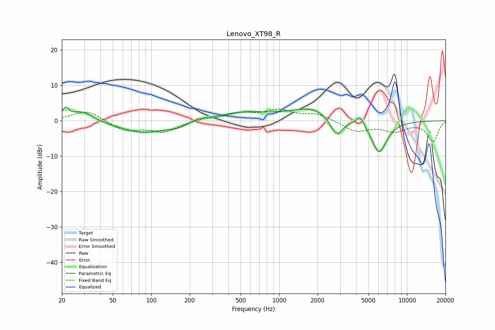

# Lenovo_XT98_R
See [usage instructions](https://github.com/jaakkopasanen/AutoEq#usage) for more options and info.

### Parametric EQs
Apply preamp of -4.0 dB when using parametric equalizer.

|   # | Type    |   Fc (Hz) |    Q |   Gain (dB) |
|-----|---------|-----------|------|-------------|
|   1 | Peaking |        21 | 5.77 |         2.9 |
|   2 | Peaking |        29 | 1.75 |         2.9 |
|   3 | Peaking |        87 | 0.75 |        -3.4 |
|   4 | Peaking |       160 | 1.83 |        -1   |
|   5 | Peaking |       236 | 2.1  |         0.7 |
|   6 | Peaking |       524 | 0.75 |         2.2 |
|   7 | Peaking |      1809 | 0.81 |         3.6 |
|   8 | Peaking |      2810 | 2.98 |        -5.6 |
|   9 | Peaking |      4318 | 4.59 |         2.7 |
|  10 | Peaking |      6048 | 2.28 |        -9.3 |

### Fixed Band EQs
When using fixed band (also called graphic) equalizer, apply preamp of **-3.4 dB** (if available) and set gains manually with these parameters.

|   # | Type    |   Fc (Hz) |    Q |   Gain (dB) |
|-----|---------|-----------|------|-------------|
|   1 | Peaking |        31 | 1.41 |         3   |
|   2 | Peaking |        62 | 1.41 |        -2.8 |
|   3 | Peaking |       125 | 1.41 |        -3   |
|   4 | Peaking |       250 | 1.41 |         0.5 |
|   5 | Peaking |       500 | 1.41 |         1.9 |
|   6 | Peaking |      1000 | 1.41 |         2.7 |
|   7 | Peaking |      2000 | 1.41 |         1.8 |
|   8 | Peaking |      4000 | 1.41 |        -2.9 |
|   9 | Peaking |      8000 | 1.41 |        -2.7 |
|  10 | Peaking |     16000 | 1.41 |        -5.8 |

### Graphs

