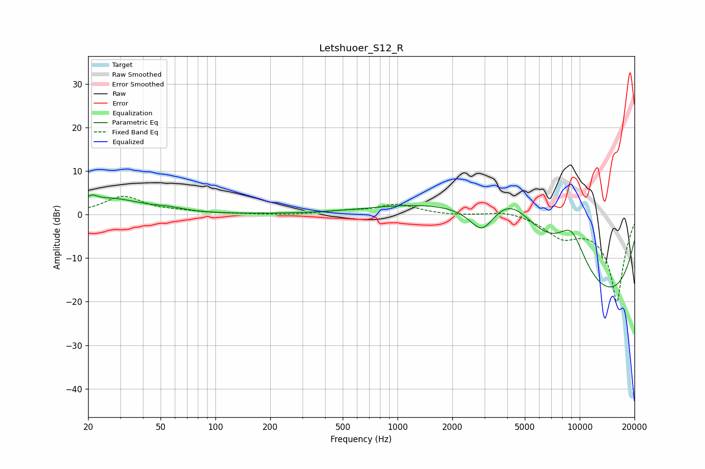

# Letshuoer_S12_R
See [usage instructions](https://github.com/jaakkopasanen/AutoEq#usage) for more options and info.

### Parametric EQs
Apply preamp of -4.6 dB when using parametric equalizer.

|   # | Type    |   Fc (Hz) |    Q |   Gain (dB) |
|-----|---------|-----------|------|-------------|
|   1 | Peaking |        21 | 1.98 |         0.2 |
|   2 | Peaking |        21 | 4.88 |         1.4 |
|   3 | Peaking |        27 | 0.86 |         3.4 |
|   4 | Peaking |        55 | 1.67 |         0.7 |
|   5 | Peaking |      2912 | 2.02 |        -6.3 |
|   6 | Peaking |      4182 | 0.49 |        20   |
|   7 | Peaking |      9009 | 1.35 |        11.6 |
|   8 | Peaking |     10000 | 0.24 |       -10.8 |
|   9 | Peaking |     10000 | 0.24 |       -11.3 |
|  10 | Peaking |     10000 | 0.23 |        -3.5 |

### Fixed Band EQs
When using fixed band (also called graphic) equalizer, apply preamp of **-4.3 dB** (if available) and set gains manually with these parameters.

|   # | Type    |   Fc (Hz) |    Q |   Gain (dB) |
|-----|---------|-----------|------|-------------|
|   1 | Peaking |        31 | 1.41 |         4.1 |
|   2 | Peaking |        62 | 1.41 |         0.5 |
|   3 | Peaking |       125 | 1.41 |         0.1 |
|   4 | Peaking |       250 | 1.41 |        -0.2 |
|   5 | Peaking |       500 | 1.41 |         0.6 |
|   6 | Peaking |      1000 | 1.41 |         2.3 |
|   7 | Peaking |      2000 | 1.41 |        -0.2 |
|   8 | Peaking |      4000 | 1.41 |         1.1 |
|   9 | Peaking |      8000 | 1.41 |        -4.2 |
|  10 | Peaking |     16000 | 1.41 |       -20   |

### Graphs

