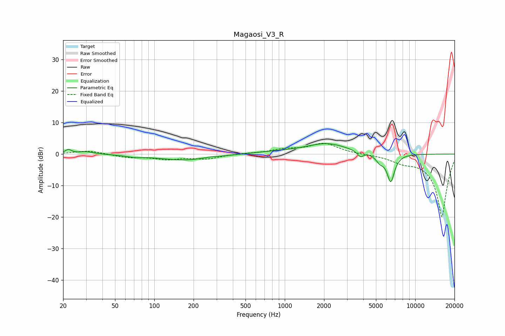

# Magaosi_V3_R
See [usage instructions](https://github.com/jaakkopasanen/AutoEq#usage) for more options and info.

### Parametric EQs
Apply preamp of -3.4 dB when using parametric equalizer.

|   # | Type    |   Fc (Hz) |    Q |   Gain (dB) |
|-----|---------|-----------|------|-------------|
|   1 | Peaking |        22 | 6    |         1.3 |
|   2 | Peaking |        30 | 2.33 |         0.8 |
|   3 | Peaking |        71 | 2.52 |        -0.5 |
|   4 | Peaking |       174 | 0.68 |        -2   |
|   5 | Peaking |       267 | 2.32 |         0.3 |
|   6 | Peaking |       815 | 0.74 |         0.6 |
|   7 | Peaking |      2097 | 0.9  |         3.3 |
|   8 | Peaking |      3799 | 6    |        -1.7 |
|   9 | Peaking |      5347 | 4.47 |        -2.1 |
|  10 | Peaking |      6491 | 4.63 |        -8.8 |

### Fixed Band EQs
When using fixed band (also called graphic) equalizer, apply preamp of **-3.5 dB** (if available) and set gains manually with these parameters.

|   # | Type    |   Fc (Hz) |    Q |   Gain (dB) |
|-----|---------|-----------|------|-------------|
|   1 | Peaking |        31 | 1.41 |         1.1 |
|   2 | Peaking |        62 | 1.41 |        -1   |
|   3 | Peaking |       125 | 1.41 |        -1.5 |
|   4 | Peaking |       250 | 1.41 |        -1.4 |
|   5 | Peaking |       500 | 1.41 |         0.2 |
|   6 | Peaking |      1000 | 1.41 |         1.3 |
|   7 | Peaking |      2000 | 1.41 |         3.3 |
|   8 | Peaking |      4000 | 1.41 |        -0   |
|   9 | Peaking |      8000 | 1.41 |        -1.8 |
|  10 | Peaking |     16000 | 1.41 |       -20   |

### Graphs

