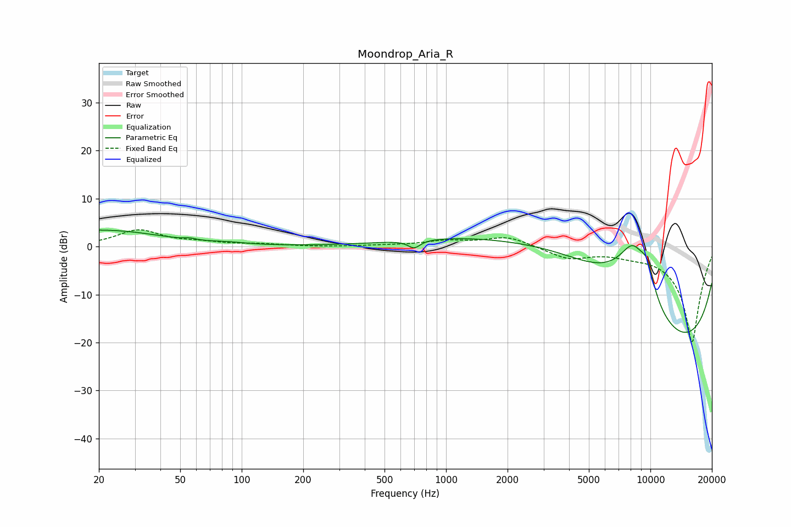

# Moondrop_Aria_R
See [usage instructions](https://github.com/jaakkopasanen/AutoEq#usage) for more options and info.

### Parametric EQs
Apply preamp of -3.5 dB when using parametric equalizer.

|   # | Type    |   Fc (Hz) |    Q |   Gain (dB) |
|-----|---------|-----------|------|-------------|
|   1 | Peaking |        21 | 0.57 |         3.8 |
|   2 | Peaking |        23 | 1.15 |        -0.4 |
|   3 | Peaking |        56 | 5.78 |         0.3 |
|   4 | Peaking |        86 | 1.71 |         0.3 |
|   5 | Peaking |       698 | 4.79 |        -1.7 |
|   6 | Peaking |      3661 | 0.33 |        12.5 |
|   7 | Peaking |      8217 | 0.95 |        20   |
|   8 | Peaking |      9640 | 3.42 |         5.2 |
|   9 | Peaking |     10000 | 0.24 |       -14.7 |
|  10 | Peaking |     10000 | 0.24 |       -15.7 |

### Fixed Band EQs
When using fixed band (also called graphic) equalizer, apply preamp of **-3.6 dB** (if available) and set gains manually with these parameters.

|   # | Type    |   Fc (Hz) |    Q |   Gain (dB) |
|-----|---------|-----------|------|-------------|
|   1 | Peaking |        31 | 1.41 |         3.4 |
|   2 | Peaking |        62 | 1.41 |         0.7 |
|   3 | Peaking |       125 | 1.41 |         0.4 |
|   4 | Peaking |       250 | 1.41 |        -0.1 |
|   5 | Peaking |       500 | 1.41 |         0.2 |
|   6 | Peaking |      1000 | 1.41 |         1.1 |
|   7 | Peaking |      2000 | 1.41 |         2.1 |
|   8 | Peaking |      4000 | 1.41 |        -2.4 |
|   9 | Peaking |      8000 | 1.41 |        -0.9 |
|  10 | Peaking |     16000 | 1.41 |       -20   |

### Graphs

