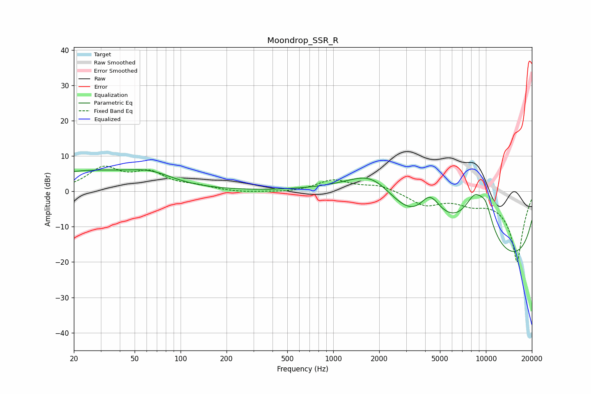

# Moondrop_SSR_R
See [usage instructions](https://github.com/jaakkopasanen/AutoEq#usage) for more options and info.

### Parametric EQs
Apply preamp of -6.2 dB when using parametric equalizer.

|   # | Type    |   Fc (Hz) |    Q |   Gain (dB) |
|-----|---------|-----------|------|-------------|
|   1 | Peaking |        25 | 0.37 |         5.5 |
|   2 | Peaking |        53 | 5.82 |         0.1 |
|   3 | Peaking |        64 | 1.03 |         2.5 |
|   4 | Peaking |      1798 | 0.7  |        11.9 |
|   5 | Peaking |      3615 | 1.04 |        -4.7 |
|   6 | Peaking |      4277 | 1.53 |        11.7 |
|   7 | Peaking |      8452 | 0.99 |        19.2 |
|   8 | Peaking |      9971 | 2.66 |         6.2 |
|   9 | Peaking |     10000 | 0.22 |        -8.2 |
|  10 | Peaking |     10000 | 0.18 |       -16.9 |

### Fixed Band EQs
When using fixed band (also called graphic) equalizer, apply preamp of **-7.3 dB** (if available) and set gains manually with these parameters.

|   # | Type    |   Fc (Hz) |    Q |   Gain (dB) |
|-----|---------|-----------|------|-------------|
|   1 | Peaking |        31 | 1.41 |         6.2 |
|   2 | Peaking |        62 | 1.41 |         4.7 |
|   3 | Peaking |       125 | 1.41 |         1.2 |
|   4 | Peaking |       250 | 1.41 |        -0.4 |
|   5 | Peaking |       500 | 1.41 |        -0.4 |
|   6 | Peaking |      1000 | 1.41 |         3.2 |
|   7 | Peaking |      2000 | 1.41 |         1.8 |
|   8 | Peaking |      4000 | 1.41 |        -3.7 |
|   9 | Peaking |      8000 | 1.41 |        -2.4 |
|  10 | Peaking |     16000 | 1.41 |       -20   |

### Graphs

