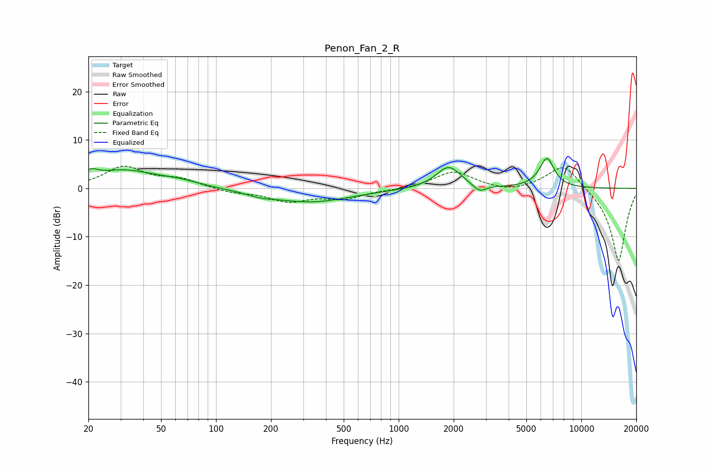

# Penon_Fan_2_R
See [usage instructions](https://github.com/jaakkopasanen/AutoEq#usage) for more options and info.

### Parametric EQs
Apply preamp of -6.3 dB when using parametric equalizer.

|   # | Type    |   Fc (Hz) |    Q |   Gain (dB) |
|-----|---------|-----------|------|-------------|
|   1 | Peaking |        20 | 4.7  |         4   |
|   2 | Peaking |        20 | 5.99 |        -2.5 |
|   3 | Peaking |        31 | 0.78 |         3.6 |
|   4 | Peaking |        63 | 1.28 |         0.9 |
|   5 | Peaking |       175 | 1.98 |        -0.7 |
|   6 | Peaking |       327 | 0.64 |        -2.8 |
|   7 | Peaking |      1879 | 2.09 |         4.6 |
|   8 | Peaking |      2769 | 3.9  |        -1.6 |
|   9 | Peaking |      6160 | 2.45 |         0.6 |
|  10 | Peaking |      6501 | 3.51 |         5.5 |

### Fixed Band EQs
When using fixed band (also called graphic) equalizer, apply preamp of **-4.7 dB** (if available) and set gains manually with these parameters.

|   # | Type    |   Fc (Hz) |    Q |   Gain (dB) |
|-----|---------|-----------|------|-------------|
|   1 | Peaking |        31 | 1.41 |         4.3 |
|   2 | Peaking |        62 | 1.41 |         1.7 |
|   3 | Peaking |       125 | 1.41 |        -0.8 |
|   4 | Peaking |       250 | 1.41 |        -2.5 |
|   5 | Peaking |       500 | 1.41 |        -1.9 |
|   6 | Peaking |      1000 | 1.41 |        -0.2 |
|   7 | Peaking |      2000 | 1.41 |         3.5 |
|   8 | Peaking |      4000 | 1.41 |        -0.9 |
|   9 | Peaking |      8000 | 1.41 |         5.4 |
|  10 | Peaking |     16000 | 1.41 |       -15.3 |

### Graphs

