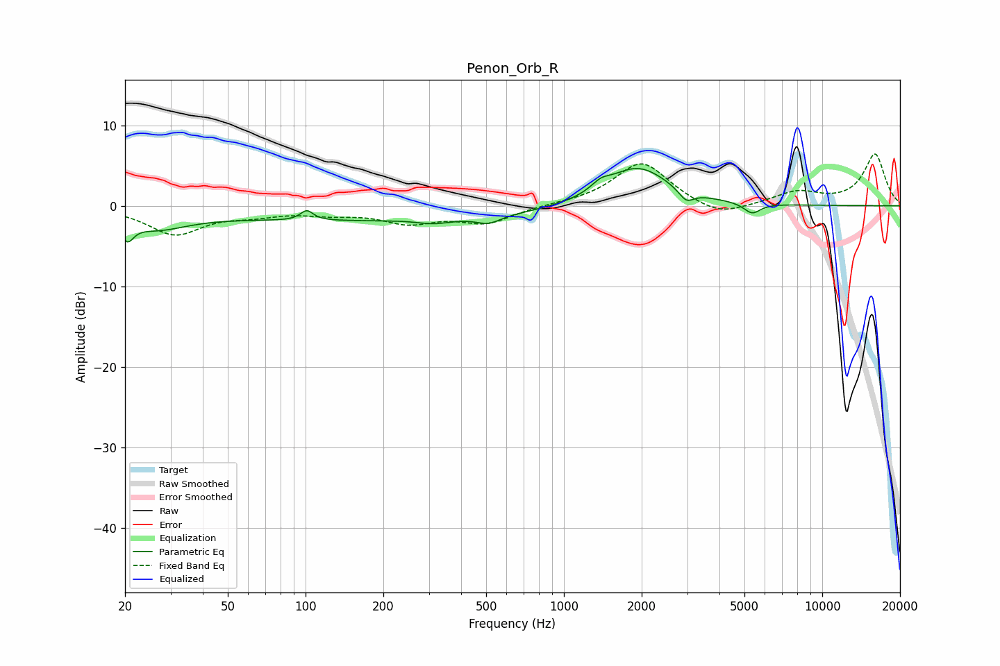

# Penon_Orb_R
See [usage instructions](https://github.com/jaakkopasanen/AutoEq#usage) for more options and info.

### Parametric EQs
Apply preamp of -4.7 dB when using parametric equalizer.

|   # | Type    |   Fc (Hz) |    Q |   Gain (dB) |
|-----|---------|-----------|------|-------------|
|   1 | Peaking |        20 | 5.83 |        -2.4 |
|   2 | Peaking |        26 | 1.16 |        -2.2 |
|   3 | Peaking |       101 | 5.96 |         1.2 |
|   4 | Peaking |       175 | 0.18 |        -1.8 |
|   5 | Peaking |       313 | 2.36 |        -0.5 |
|   6 | Peaking |       511 | 3.05 |        -0.9 |
|   7 | Peaking |      1386 | 3.96 |         0.9 |
|   8 | Peaking |      1923 | 1.13 |         5   |
|   9 | Peaking |      2975 | 4.86 |        -1.5 |
|  10 | Peaking |      5355 | 4.31 |        -1.3 |

### Fixed Band EQs
When using fixed band (also called graphic) equalizer, apply preamp of **-6.5 dB** (if available) and set gains manually with these parameters.

|   # | Type    |   Fc (Hz) |    Q |   Gain (dB) |
|-----|---------|-----------|------|-------------|
|   1 | Peaking |        31 | 1.41 |        -3.4 |
|   2 | Peaking |        62 | 1.41 |        -0.9 |
|   3 | Peaking |       125 | 1.41 |        -0.8 |
|   4 | Peaking |       250 | 1.41 |        -1.9 |
|   5 | Peaking |       500 | 1.41 |        -2   |
|   6 | Peaking |      1000 | 1.41 |         0.1 |
|   7 | Peaking |      2000 | 1.41 |         5.5 |
|   8 | Peaking |      4000 | 1.41 |        -1.6 |
|   9 | Peaking |      8000 | 1.41 |         1.6 |
|  10 | Peaking |     16000 | 1.41 |         6.4 |

### Graphs

