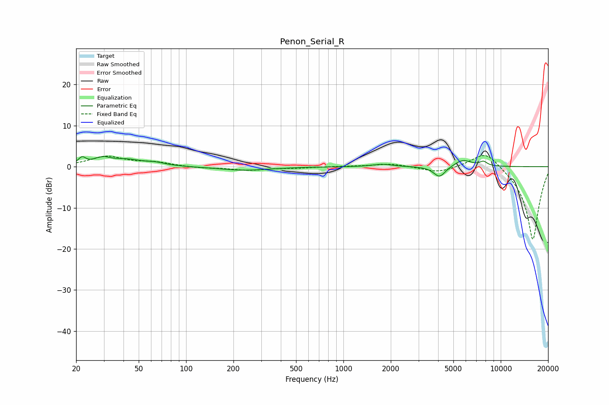

# Penon_Serial_R
See [usage instructions](https://github.com/jaakkopasanen/AutoEq#usage) for more options and info.

### Parametric EQs
Apply preamp of -2.6 dB when using parametric equalizer.

|   # | Type    |   Fc (Hz) |    Q |   Gain (dB) |
|-----|---------|-----------|------|-------------|
|   1 | Peaking |        22 | 5.98 |         1.7 |
|   2 | Peaking |        29 | 5.28 |        -1   |
|   3 | Peaking |        29 | 3.71 |         2.4 |
|   4 | Peaking |        41 | 1.26 |         1.6 |
|   5 | Peaking |        65 | 2.54 |         0.5 |
|   6 | Peaking |       234 | 0.88 |        -0.9 |
|   7 | Peaking |      1764 | 2.32 |         0.6 |
|   8 | Peaking |      4083 | 3.74 |        -2.7 |
|   9 | Peaking |      5739 | 2.52 |         1.7 |
|  10 | Peaking |      7769 | 5.67 |         1   |

### Fixed Band EQs
When using fixed band (also called graphic) equalizer, apply preamp of **-2.8 dB** (if available) and set gains manually with these parameters.

|   # | Type    |   Fc (Hz) |    Q |   Gain (dB) |
|-----|---------|-----------|------|-------------|
|   1 | Peaking |        31 | 1.41 |         2.4 |
|   2 | Peaking |        62 | 1.41 |         0.9 |
|   3 | Peaking |       125 | 1.41 |        -0.3 |
|   4 | Peaking |       250 | 1.41 |        -0.8 |
|   5 | Peaking |       500 | 1.41 |        -0.3 |
|   6 | Peaking |      1000 | 1.41 |         0.1 |
|   7 | Peaking |      2000 | 1.41 |         0.8 |
|   8 | Peaking |      4000 | 1.41 |        -1.5 |
|   9 | Peaking |      8000 | 1.41 |         4.3 |
|  10 | Peaking |     16000 | 1.41 |       -18   |

### Graphs

