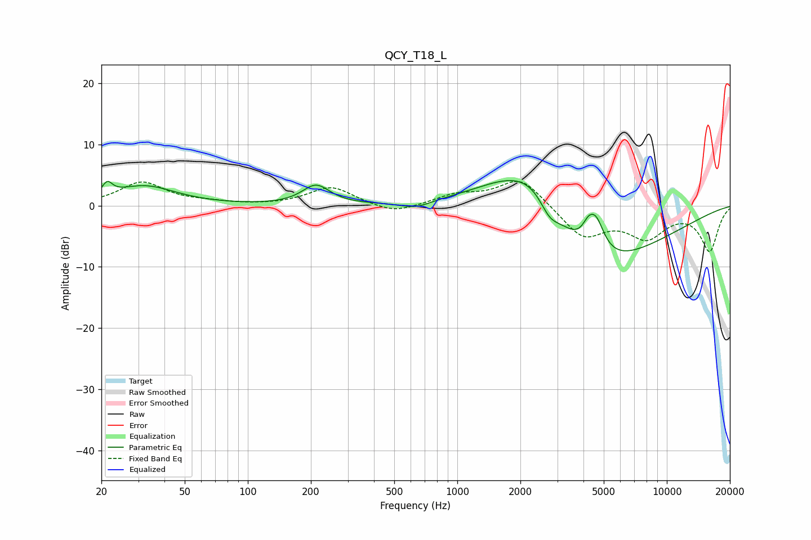

# QCY_T18_L
See [usage instructions](https://github.com/jaakkopasanen/AutoEq#usage) for more options and info.

### Parametric EQs
Apply preamp of -4.2 dB when using parametric equalizer.

|   # | Type    |   Fc (Hz) |    Q |   Gain (dB) |
|-----|---------|-----------|------|-------------|
|   1 | Peaking |        21 | 6    |         2   |
|   2 | Peaking |        32 | 0.94 |         3.2 |
|   3 | Peaking |       212 | 2.16 |         3.2 |
|   4 | Peaking |       633 | 1.83 |        -1.2 |
|   5 | Peaking |      1897 | 0.64 |         8   |
|   6 | Peaking |      2490 | 1.12 |         4.9 |
|   7 | Peaking |      2746 | 2.83 |        -3.1 |
|   8 | Peaking |      4204 | 5.13 |         1.9 |
|   9 | Peaking |      4297 | 0.46 |       -12.6 |
|  10 | Peaking |      4583 | 3.4  |         5.6 |

### Fixed Band EQs
When using fixed band (also called graphic) equalizer, apply preamp of **-4.1 dB** (if available) and set gains manually with these parameters.

|   # | Type    |   Fc (Hz) |    Q |   Gain (dB) |
|-----|---------|-----------|------|-------------|
|   1 | Peaking |        31 | 1.41 |         3.8 |
|   2 | Peaking |        62 | 1.41 |         0.4 |
|   3 | Peaking |       125 | 1.41 |        -0   |
|   4 | Peaking |       250 | 1.41 |         3.1 |
|   5 | Peaking |       500 | 1.41 |        -1.5 |
|   6 | Peaking |      1000 | 1.41 |         1.6 |
|   7 | Peaking |      2000 | 1.41 |         4.7 |
|   8 | Peaking |      4000 | 1.41 |        -5.1 |
|   9 | Peaking |      8000 | 1.41 |        -4.7 |
|  10 | Peaking |     16000 | 1.41 |        -7.3 |

### Graphs

