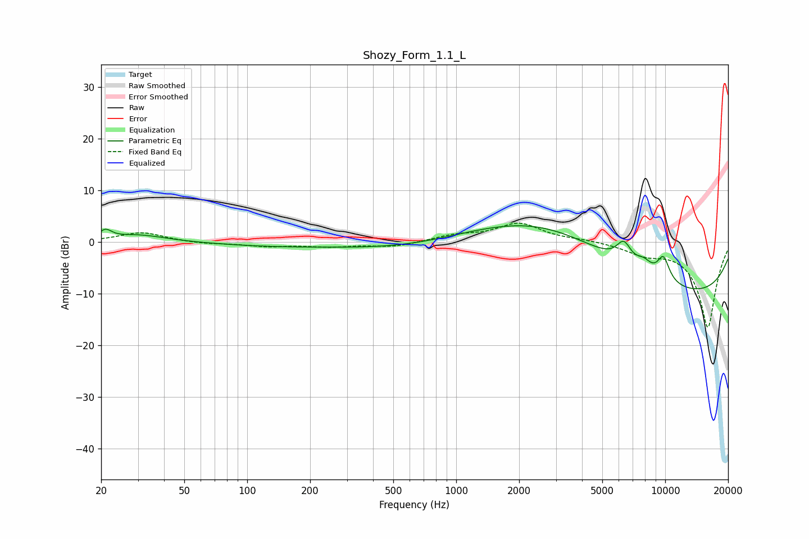

# Shozy_Form_1.1_L
See [usage instructions](https://github.com/jaakkopasanen/AutoEq#usage) for more options and info.

### Parametric EQs
Apply preamp of -3.2 dB when using parametric equalizer.

|   # | Type    |   Fc (Hz) |    Q |   Gain (dB) |
|-----|---------|-----------|------|-------------|
|   1 | Peaking |        21 | 4.96 |         1.7 |
|   2 | Peaking |        30 | 1.06 |         1.4 |
|   3 | Peaking |       130 | 0.52 |        -0.7 |
|   4 | Peaking |       706 | 0.44 |        -2.7 |
|   5 | Peaking |      2785 | 0.34 |        11.4 |
|   6 | Peaking |      6339 | 3.85 |         3.9 |
|   7 | Peaking |      7903 | 3.51 |         1.9 |
|   8 | Peaking |      8844 | 0.19 |       -10.2 |
|   9 | Peaking |      9808 | 4.15 |         4.6 |
|  10 | Peaking |      9946 | 0.18 |        -2   |

### Fixed Band EQs
When using fixed band (also called graphic) equalizer, apply preamp of **-3.8 dB** (if available) and set gains manually with these parameters.

|   # | Type    |   Fc (Hz) |    Q |   Gain (dB) |
|-----|---------|-----------|------|-------------|
|   1 | Peaking |        31 | 1.41 |         1.9 |
|   2 | Peaking |        62 | 1.41 |        -0.4 |
|   3 | Peaking |       125 | 1.41 |        -0.8 |
|   4 | Peaking |       250 | 1.41 |        -0.8 |
|   5 | Peaking |       500 | 1.41 |        -0.9 |
|   6 | Peaking |      1000 | 1.41 |         1.2 |
|   7 | Peaking |      2000 | 1.41 |         3.5 |
|   8 | Peaking |      4000 | 1.41 |         0.4 |
|   9 | Peaking |      8000 | 1.41 |        -1.9 |
|  10 | Peaking |     16000 | 1.41 |       -16.5 |

### Graphs

