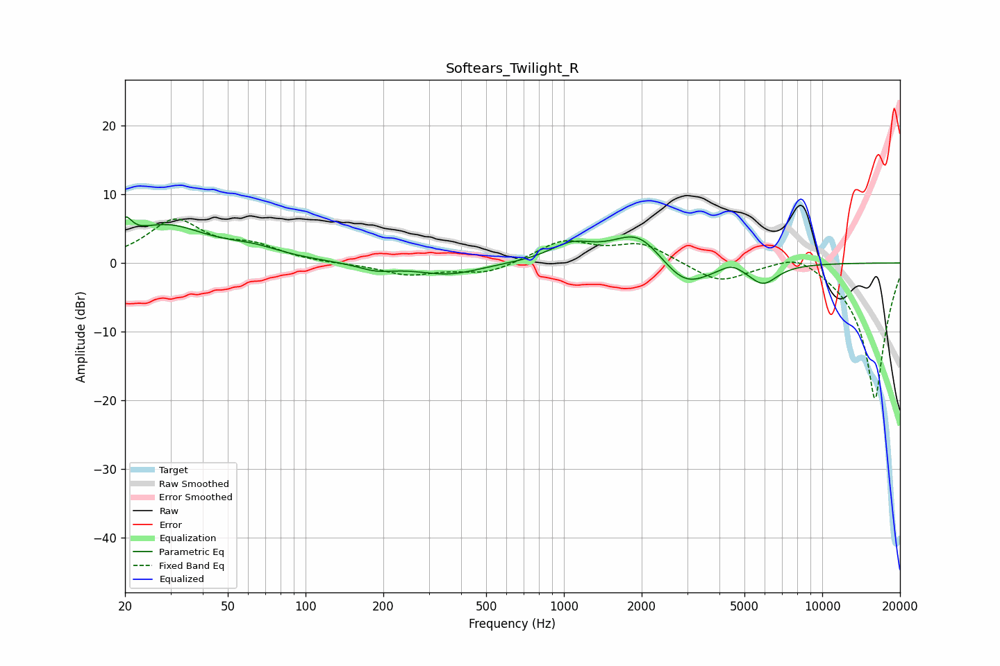

# Softears_Twilight_R
See [usage instructions](https://github.com/jaakkopasanen/AutoEq#usage) for more options and info.

### Parametric EQs
Apply preamp of -6.8 dB when using parametric equalizer.

|   # | Type    |   Fc (Hz) |    Q |   Gain (dB) |
|-----|---------|-----------|------|-------------|
|   1 | Peaking |        20 | 5.59 |         3   |
|   2 | Peaking |        29 | 0.88 |         5.2 |
|   3 | Peaking |        63 | 1.27 |         1.3 |
|   4 | Peaking |       187 | 1.98 |        -1   |
|   5 | Peaking |       358 | 1.14 |        -1.7 |
|   6 | Peaking |      1071 | 1.66 |         2.4 |
|   7 | Peaking |      1941 | 1.43 |         4.8 |
|   8 | Peaking |      2936 | 1.48 |        -4.1 |
|   9 | Peaking |      4460 | 3.17 |         1.1 |
|  10 | Peaking |      5902 | 2.46 |        -2.9 |

### Fixed Band EQs
When using fixed band (also called graphic) equalizer, apply preamp of **-6.5 dB** (if available) and set gains manually with these parameters.

|   # | Type    |   Fc (Hz) |    Q |   Gain (dB) |
|-----|---------|-----------|------|-------------|
|   1 | Peaking |        31 | 1.41 |         6   |
|   2 | Peaking |        62 | 1.41 |         2.1 |
|   3 | Peaking |       125 | 1.41 |        -0.1 |
|   4 | Peaking |       250 | 1.41 |        -1.7 |
|   5 | Peaking |       500 | 1.41 |        -1.6 |
|   6 | Peaking |      1000 | 1.41 |         3.1 |
|   7 | Peaking |      2000 | 1.41 |         2.7 |
|   8 | Peaking |      4000 | 1.41 |        -2.8 |
|   9 | Peaking |      8000 | 1.41 |         2.2 |
|  10 | Peaking |     16000 | 1.41 |       -20   |

### Graphs

