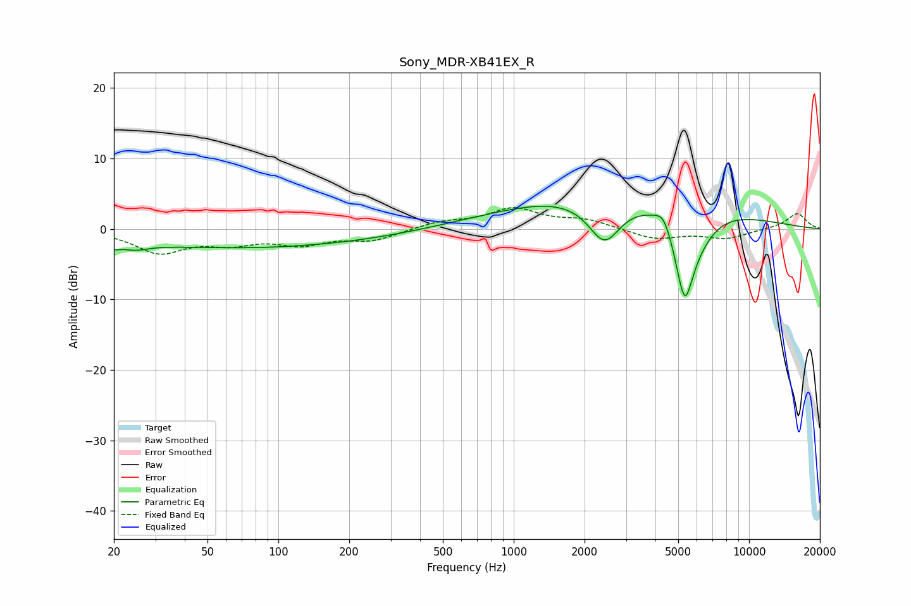

# Sony_MDR-XB41EX_R
See [usage instructions](https://github.com/jaakkopasanen/AutoEq#usage) for more options and info.

### Parametric EQs
Apply preamp of -3.3 dB when using parametric equalizer.

|   # | Type    |   Fc (Hz) |    Q |   Gain (dB) |
|-----|---------|-----------|------|-------------|
|   1 | Peaking |        20 | 5.2  |        -0.7 |
|   2 | Peaking |        25 | 2.65 |        -0.8 |
|   3 | Peaking |        67 | 0.21 |        -2.6 |
|   4 | Peaking |        87 | 1.14 |        -0.1 |
|   5 | Peaking |       584 | 4.59 |         0   |
|   6 | Peaking |      2432 | 2.02 |        -6.3 |
|   7 | Peaking |      2799 | 0.29 |         5.4 |
|   8 | Peaking |      4341 | 4.03 |         2.2 |
|   9 | Peaking |      5324 | 3.07 |       -12.8 |
|  10 | Peaking |      6212 | 1.89 |        -1.9 |

### Fixed Band EQs
When using fixed band (also called graphic) equalizer, apply preamp of **-3.1 dB** (if available) and set gains manually with these parameters.

|   # | Type    |   Fc (Hz) |    Q |   Gain (dB) |
|-----|---------|-----------|------|-------------|
|   1 | Peaking |        31 | 1.41 |        -3.2 |
|   2 | Peaking |        62 | 1.41 |        -1.7 |
|   3 | Peaking |       125 | 1.41 |        -1.9 |
|   4 | Peaking |       250 | 1.41 |        -1.5 |
|   5 | Peaking |       500 | 1.41 |         1   |
|   6 | Peaking |      1000 | 1.41 |         2.8 |
|   7 | Peaking |      2000 | 1.41 |         1.2 |
|   8 | Peaking |      4000 | 1.41 |        -1.4 |
|   9 | Peaking |      8000 | 1.41 |        -1.3 |
|  10 | Peaking |     16000 | 1.41 |         2.2 |

### Graphs

