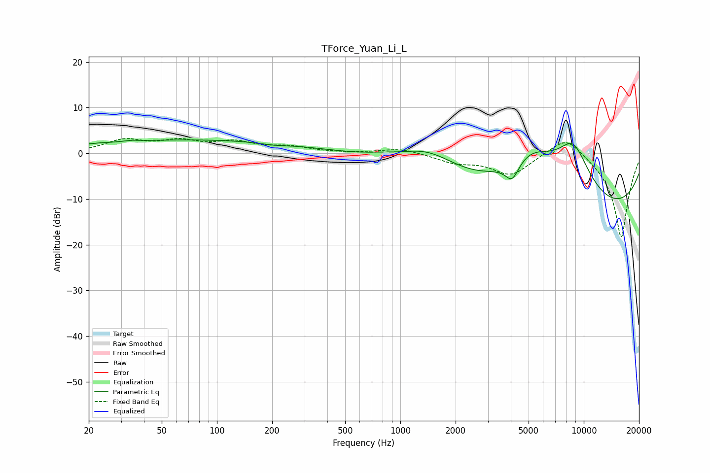

# TForce_Yuan_Li_L
See [usage instructions](https://github.com/jaakkopasanen/AutoEq#usage) for more options and info.

### Parametric EQs
Apply preamp of -3.0 dB when using parametric equalizer.

|   # | Type    |   Fc (Hz) |    Q |   Gain (dB) |
|-----|---------|-----------|------|-------------|
|   1 | Peaking |        22 | 5.65 |         0.1 |
|   2 | Peaking |        34 | 4.52 |         0.2 |
|   3 | Peaking |        76 | 0.2  |         3   |
|   4 | Peaking |       203 | 1.66 |        -0.5 |
|   5 | Peaking |       777 | 1.36 |         0.5 |
|   6 | Peaking |      1416 | 0.84 |         5.6 |
|   7 | Peaking |      4072 | 3.72 |        -4.1 |
|   8 | Peaking |      5158 | 0.75 |        12   |
|   9 | Peaking |      8017 | 0.18 |       -17.2 |
|  10 | Peaking |      8766 | 1.15 |        13   |

### Fixed Band EQs
When using fixed band (also called graphic) equalizer, apply preamp of **-3.3 dB** (if available) and set gains manually with these parameters.

|   # | Type    |   Fc (Hz) |    Q |   Gain (dB) |
|-----|---------|-----------|------|-------------|
|   1 | Peaking |        31 | 1.41 |         2.7 |
|   2 | Peaking |        62 | 1.41 |         2.3 |
|   3 | Peaking |       125 | 1.41 |         2.2 |
|   4 | Peaking |       250 | 1.41 |         1.2 |
|   5 | Peaking |       500 | 1.41 |         0   |
|   6 | Peaking |      1000 | 1.41 |         1.1 |
|   7 | Peaking |      2000 | 1.41 |        -1.8 |
|   8 | Peaking |      4000 | 1.41 |        -4.6 |
|   9 | Peaking |      8000 | 1.41 |         4.6 |
|  10 | Peaking |     16000 | 1.41 |       -18.7 |

### Graphs

