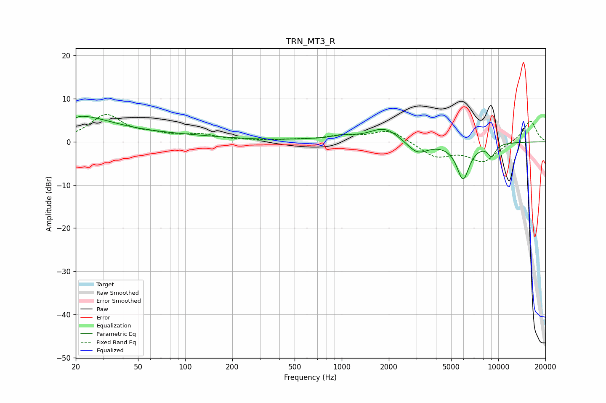

# TRN_MT3_R
See [usage instructions](https://github.com/jaakkopasanen/AutoEq#usage) for more options and info.

### Parametric EQs
Apply preamp of -6.0 dB when using parametric equalizer.

|   # | Type    |   Fc (Hz) |    Q |   Gain (dB) |
|-----|---------|-----------|------|-------------|
|   1 | Peaking |        20 | 0.65 |         5.4 |
|   2 | Peaking |        20 | 5.99 |        -3.7 |
|   3 | Peaking |        20 | 5.91 |         3.2 |
|   4 | Peaking |        70 | 0.35 |         1.4 |
|   5 | Peaking |       701 | 0.84 |         0.4 |
|   6 | Peaking |      1026 | 2.28 |         0.8 |
|   7 | Peaking |      1881 | 1.44 |         3.3 |
|   8 | Peaking |      3039 | 2.07 |        -3   |
|   9 | Peaking |      5959 | 3.34 |        -8.4 |
|  10 | Peaking |      9065 | 4.9  |        -2.7 |

### Fixed Band EQs
When using fixed band (also called graphic) equalizer, apply preamp of **-6.4 dB** (if available) and set gains manually with these parameters.

|   # | Type    |   Fc (Hz) |    Q |   Gain (dB) |
|-----|---------|-----------|------|-------------|
|   1 | Peaking |        31 | 1.41 |         6.1 |
|   2 | Peaking |        62 | 1.41 |         1.2 |
|   3 | Peaking |       125 | 1.41 |         1.4 |
|   4 | Peaking |       250 | 1.41 |         0.2 |
|   5 | Peaking |       500 | 1.41 |         0.3 |
|   6 | Peaking |      1000 | 1.41 |         1.2 |
|   7 | Peaking |      2000 | 1.41 |         2.8 |
|   8 | Peaking |      4000 | 1.41 |        -3.4 |
|   9 | Peaking |      8000 | 1.41 |        -4.4 |
|  10 | Peaking |     16000 | 1.41 |         5.1 |

### Graphs

