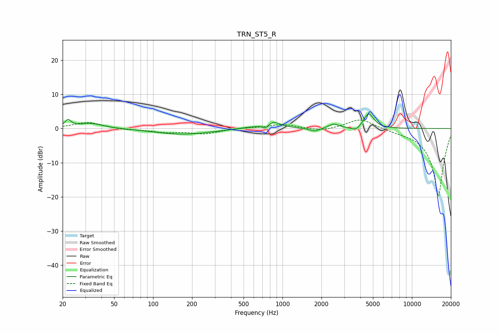

# TRN_ST5_R
See [usage instructions](https://github.com/jaakkopasanen/AutoEq#usage) for more options and info.

### Parametric EQs
Apply preamp of -4.4 dB when using parametric equalizer.

|   # | Type    |   Fc (Hz) |    Q |   Gain (dB) |
|-----|---------|-----------|------|-------------|
|   1 | Peaking |        22 | 6    |         2.1 |
|   2 | Peaking |        33 | 1.48 |         1.5 |
|   3 | Peaking |       169 | 0.67 |        -1.7 |
|   4 | Peaking |       551 | 1.51 |         0.4 |
|   5 | Peaking |       745 | 6    |        -1.3 |
|   6 | Peaking |       838 | 2.47 |         2.1 |
|   7 | Peaking |      1777 | 3.69 |        -1   |
|   8 | Peaking |      2490 | 3.68 |         1.3 |
|   9 | Peaking |      3708 | 3.83 |        -1.3 |
|  10 | Peaking |      4624 | 3.58 |         4.5 |

### Fixed Band EQs
When using fixed band (also called graphic) equalizer, apply preamp of **-2.6 dB** (if available) and set gains manually with these parameters.

|   # | Type    |   Fc (Hz) |    Q |   Gain (dB) |
|-----|---------|-----------|------|-------------|
|   1 | Peaking |        31 | 1.41 |         1.9 |
|   2 | Peaking |        62 | 1.41 |        -0.4 |
|   3 | Peaking |       125 | 1.41 |        -1   |
|   4 | Peaking |       250 | 1.41 |        -1.5 |
|   5 | Peaking |       500 | 1.41 |         0.2 |
|   6 | Peaking |      1000 | 1.41 |         1.2 |
|   7 | Peaking |      2000 | 1.41 |        -0.8 |
|   8 | Peaking |      4000 | 1.41 |         3   |
|   9 | Peaking |      8000 | 1.41 |        -0.4 |
|  10 | Peaking |     16000 | 1.41 |       -20   |

### Graphs

