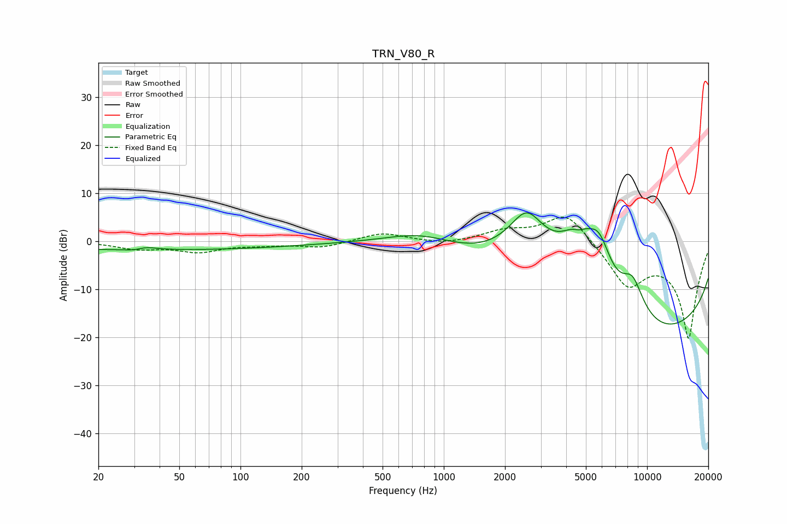

# TRN_V80_R
See [usage instructions](https://github.com/jaakkopasanen/AutoEq#usage) for more options and info.

### Parametric EQs
Apply preamp of -6.0 dB when using parametric equalizer.

|   # | Type    |   Fc (Hz) |    Q |   Gain (dB) |
|-----|---------|-----------|------|-------------|
|   1 | Peaking |        31 | 2.82 |        -0.7 |
|   2 | Peaking |        33 | 2.55 |         1   |
|   3 | Peaking |        36 | 0.18 |        -1.8 |
|   4 | Peaking |       780 | 0.8  |         3.3 |
|   5 | Peaking |      2558 | 1.24 |        13.3 |
|   6 | Peaking |      4615 | 1.46 |        12.4 |
|   7 | Peaking |      4622 | 4.04 |        -2.3 |
|   8 | Peaking |      5827 | 2.26 |         8.2 |
|   9 | Peaking |      8478 | 2.27 |         7.4 |
|  10 | Peaking |     10000 | 0.18 |       -20   |

### Fixed Band EQs
When using fixed band (also called graphic) equalizer, apply preamp of **-5.1 dB** (if available) and set gains manually with these parameters.

|   # | Type    |   Fc (Hz) |    Q |   Gain (dB) |
|-----|---------|-----------|------|-------------|
|   1 | Peaking |        31 | 1.41 |        -1.4 |
|   2 | Peaking |        62 | 1.41 |        -2   |
|   3 | Peaking |       125 | 1.41 |        -0.6 |
|   4 | Peaking |       250 | 1.41 |        -1.3 |
|   5 | Peaking |       500 | 1.41 |         1.8 |
|   6 | Peaking |      1000 | 1.41 |        -0.7 |
|   7 | Peaking |      2000 | 1.41 |         2   |
|   8 | Peaking |      4000 | 1.41 |         6.3 |
|   9 | Peaking |      8000 | 1.41 |        -8.7 |
|  10 | Peaking |     16000 | 1.41 |       -20   |

### Graphs

