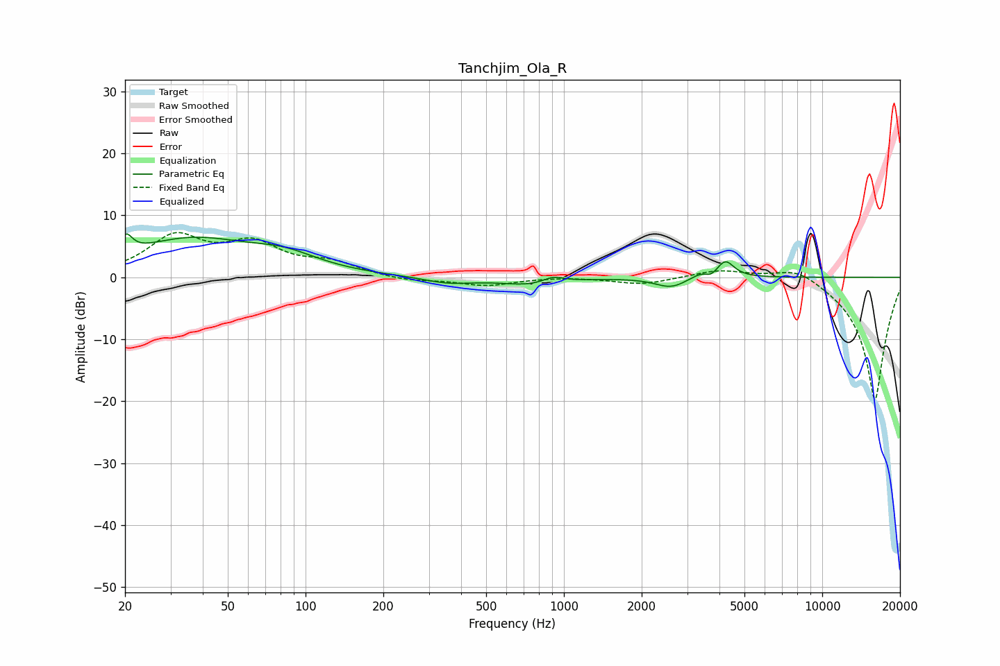

# Tanchjim_Ola_R
See [usage instructions](https://github.com/jaakkopasanen/AutoEq#usage) for more options and info.

### Parametric EQs
Apply preamp of -7.1 dB when using parametric equalizer.

|   # | Type    |   Fc (Hz) |    Q |   Gain (dB) |
|-----|---------|-----------|------|-------------|
|   1 | Peaking |        20 | 5.78 |         3   |
|   2 | Peaking |        36 | 0.59 |         6   |
|   3 | Peaking |        83 | 1.08 |         2.2 |
|   4 | Peaking |       357 | 1.46 |        -1   |
|   5 | Peaking |       753 | 1.21 |        -1.2 |
|   6 | Peaking |       909 | 3.33 |         1.1 |
|   7 | Peaking |      2602 | 2.34 |        -1.7 |
|   8 | Peaking |      3543 | 3.46 |         2.1 |
|   9 | Peaking |      3666 | 4.54 |        -2   |
|  10 | Peaking |      4215 | 4.3  |         2.7 |

### Fixed Band EQs
When using fixed band (also called graphic) equalizer, apply preamp of **-7.3 dB** (if available) and set gains manually with these parameters.

|   # | Type    |   Fc (Hz) |    Q |   Gain (dB) |
|-----|---------|-----------|------|-------------|
|   1 | Peaking |        31 | 1.41 |         6.2 |
|   2 | Peaking |        62 | 1.41 |         4.8 |
|   3 | Peaking |       125 | 1.41 |         2   |
|   4 | Peaking |       250 | 1.41 |        -0.7 |
|   5 | Peaking |       500 | 1.41 |        -1.3 |
|   6 | Peaking |      1000 | 1.41 |         0.1 |
|   7 | Peaking |      2000 | 1.41 |        -1.1 |
|   8 | Peaking |      4000 | 1.41 |         1.3 |
|   9 | Peaking |      8000 | 1.41 |         2.2 |
|  10 | Peaking |     16000 | 1.41 |       -20   |

### Graphs

