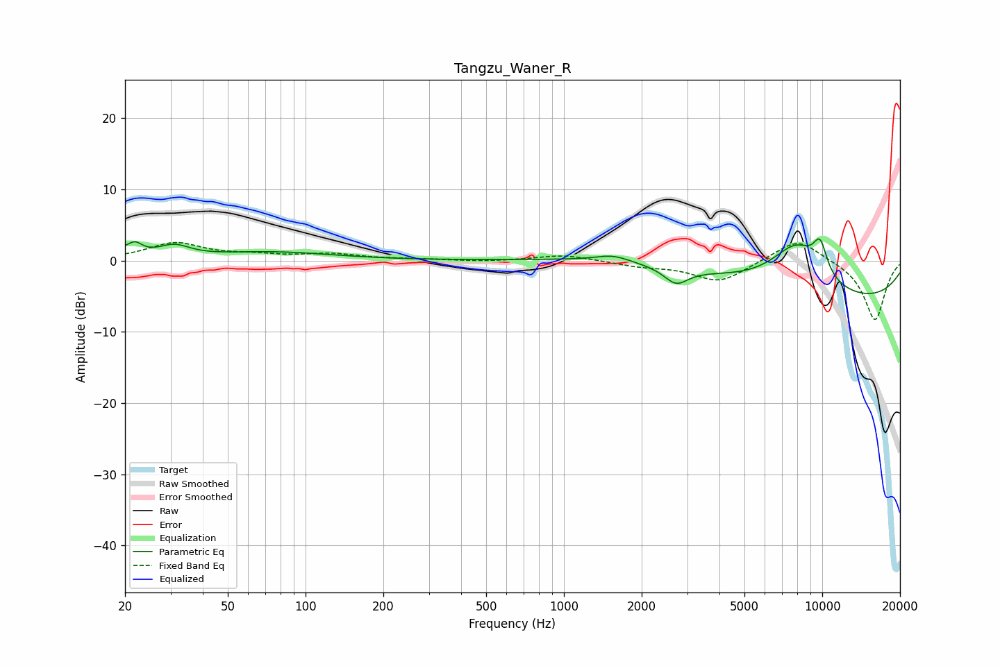

# Tangzu_Waner_R
See [usage instructions](https://github.com/jaakkopasanen/AutoEq#usage) for more options and info.

### Parametric EQs
Apply preamp of -3.1 dB when using parametric equalizer.

|   # | Type    |   Fc (Hz) |    Q |   Gain (dB) |
|-----|---------|-----------|------|-------------|
|   1 | Peaking |        20 | 2.76 |         1.1 |
|   2 | Peaking |        22 | 5.68 |         1.1 |
|   3 | Peaking |        31 | 2.35 |         1.6 |
|   4 | Peaking |        74 | 0.61 |         1.1 |
|   5 | Peaking |      1545 | 2.17 |         0.9 |
|   6 | Peaking |      2718 | 3.05 |        -2.3 |
|   7 | Peaking |      3561 | 0.35 |         2.1 |
|   8 | Peaking |      7934 | 1.32 |         6.4 |
|   9 | Peaking |      9813 | 4.49 |         4.2 |
|  10 | Peaking |     10000 | 0.21 |        -6.3 |

### Fixed Band EQs
When using fixed band (also called graphic) equalizer, apply preamp of **-2.6 dB** (if available) and set gains manually with these parameters.

|   # | Type    |   Fc (Hz) |    Q |   Gain (dB) |
|-----|---------|-----------|------|-------------|
|   1 | Peaking |        31 | 1.41 |         2.4 |
|   2 | Peaking |        62 | 1.41 |         0.6 |
|   3 | Peaking |       125 | 1.41 |         0.8 |
|   4 | Peaking |       250 | 1.41 |         0.1 |
|   5 | Peaking |       500 | 1.41 |        -0.2 |
|   6 | Peaking |      1000 | 1.41 |         0.8 |
|   7 | Peaking |      2000 | 1.41 |        -0.7 |
|   8 | Peaking |      4000 | 1.41 |        -3   |
|   9 | Peaking |      8000 | 1.41 |         3.3 |
|  10 | Peaking |     16000 | 1.41 |        -8.4 |

### Graphs

