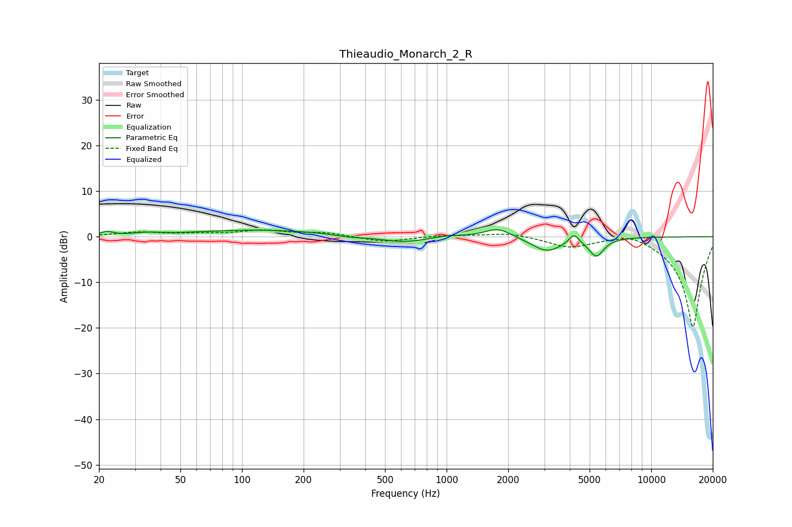

# Thieaudio_Monarch_2_R
See [usage instructions](https://github.com/jaakkopasanen/AutoEq#usage) for more options and info.

### Parametric EQs
Apply preamp of -1.6 dB when using parametric equalizer.

|   # | Type    |   Fc (Hz) |    Q |   Gain (dB) |
|-----|---------|-----------|------|-------------|
|   1 | Peaking |        22 | 4.74 |         0.8 |
|   2 | Peaking |        34 | 2.16 |         0.5 |
|   3 | Peaking |       123 | 0.43 |         1.5 |
|   4 | Peaking |       336 | 1.9  |        -0.5 |
|   5 | Peaking |       618 | 1.23 |        -1.3 |
|   6 | Peaking |      1008 | 2.16 |         0.5 |
|   7 | Peaking |      1786 | 2.15 |         2.1 |
|   8 | Peaking |      3087 | 1.87 |        -3.2 |
|   9 | Peaking |      4193 | 6    |         2.2 |
|  10 | Peaking |      5393 | 3.82 |        -4   |

### Fixed Band EQs
When using fixed band (also called graphic) equalizer, apply preamp of **-1.6 dB** (if available) and set gains manually with these parameters.

|   # | Type    |   Fc (Hz) |    Q |   Gain (dB) |
|-----|---------|-----------|------|-------------|
|   1 | Peaking |        31 | 1.41 |         0.9 |
|   2 | Peaking |        62 | 1.41 |         0.5 |
|   3 | Peaking |       125 | 1.41 |         1.3 |
|   4 | Peaking |       250 | 1.41 |         0.9 |
|   5 | Peaking |       500 | 1.41 |        -1.2 |
|   6 | Peaking |      1000 | 1.41 |         0.3 |
|   7 | Peaking |      2000 | 1.41 |         0.9 |
|   8 | Peaking |      4000 | 1.41 |        -2.2 |
|   9 | Peaking |      8000 | 1.41 |         1.5 |
|  10 | Peaking |     16000 | 1.41 |       -20   |

### Graphs

