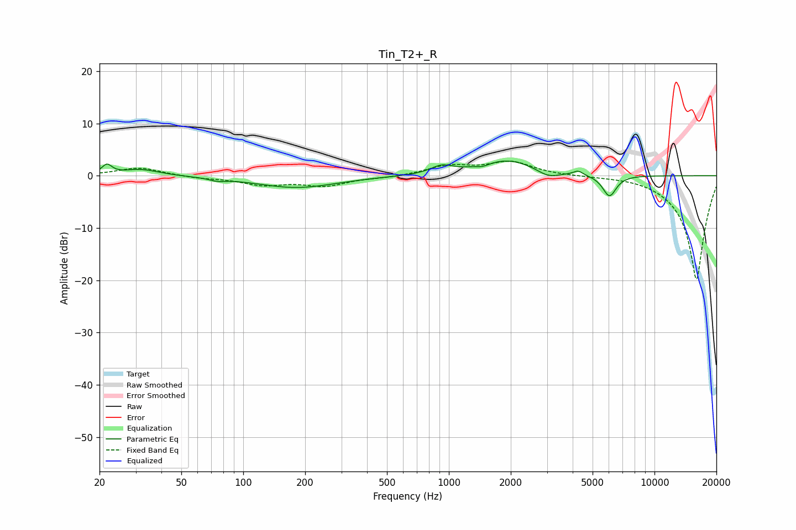

# Tin_T2+_R
See [usage instructions](https://github.com/jaakkopasanen/AutoEq#usage) for more options and info.

### Parametric EQs
Apply preamp of -2.9 dB when using parametric equalizer.

|   # | Type    |   Fc (Hz) |    Q |   Gain (dB) |
|-----|---------|-----------|------|-------------|
|   1 | Peaking |        22 | 6    |         1.8 |
|   2 | Peaking |        32 | 1.57 |         1.2 |
|   3 | Peaking |        75 | 3.85 |        -0.5 |
|   4 | Peaking |       181 | 0.73 |        -2.3 |
|   5 | Peaking |       922 | 2.72 |         1.4 |
|   6 | Peaking |      1463 | 4.24 |        -0.5 |
|   7 | Peaking |      1926 | 1.01 |         3.1 |
|   8 | Peaking |      3047 | 2.54 |        -1.4 |
|   9 | Peaking |      4253 | 6    |         0.8 |
|  10 | Peaking |      6038 | 4.18 |        -4.1 |

### Fixed Band EQs
When using fixed band (also called graphic) equalizer, apply preamp of **-2.9 dB** (if available) and set gains manually with these parameters.

|   # | Type    |   Fc (Hz) |    Q |   Gain (dB) |
|-----|---------|-----------|------|-------------|
|   1 | Peaking |        31 | 1.41 |         1.6 |
|   2 | Peaking |        62 | 1.41 |        -0.4 |
|   3 | Peaking |       125 | 1.41 |        -1.6 |
|   4 | Peaking |       250 | 1.41 |        -1.8 |
|   5 | Peaking |       500 | 1.41 |        -0.3 |
|   6 | Peaking |      1000 | 1.41 |         1.8 |
|   7 | Peaking |      2000 | 1.41 |         2.6 |
|   8 | Peaking |      4000 | 1.41 |        -0   |
|   9 | Peaking |      8000 | 1.41 |         0.2 |
|  10 | Peaking |     16000 | 1.41 |       -20   |

### Graphs

