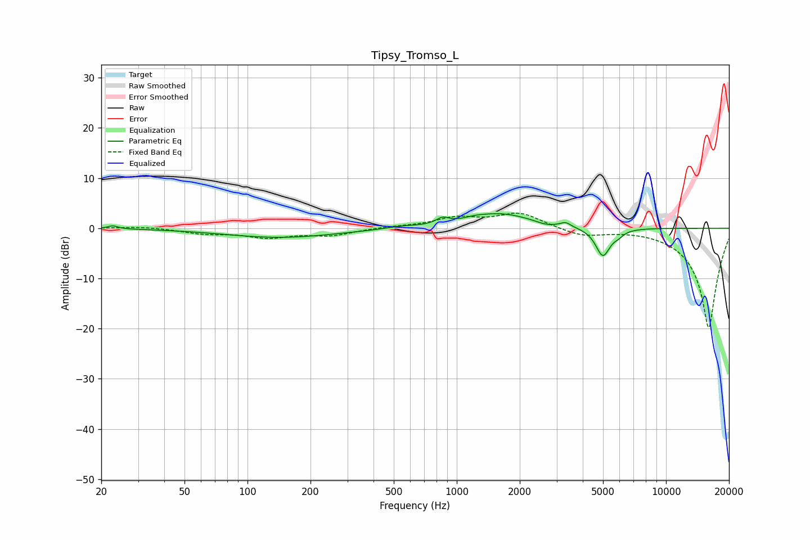

# Tipsy_Tromso_L
See [usage instructions](https://github.com/jaakkopasanen/AutoEq#usage) for more options and info.

### Parametric EQs
Apply preamp of -3.0 dB when using parametric equalizer.

|   # | Type    |   Fc (Hz) |    Q |   Gain (dB) |
|-----|---------|-----------|------|-------------|
|   1 | Peaking |        23 | 6    |         0.6 |
|   2 | Peaking |       144 | 0.53 |        -1.8 |
|   3 | Peaking |       537 | 2.12 |         0.4 |
|   4 | Peaking |       855 | 4.71 |         1.2 |
|   5 | Peaking |      1223 | 3.06 |         0.3 |
|   6 | Peaking |      1611 | 0.94 |         2.9 |
|   7 | Peaking |      2668 | 3.22 |        -0.5 |
|   8 | Peaking |      3314 | 6    |         0.8 |
|   9 | Peaking |      4992 | 4.04 |        -5.7 |
|  10 | Peaking |      5926 | 5.73 |        -0.8 |

### Fixed Band EQs
When using fixed band (also called graphic) equalizer, apply preamp of **-3.1 dB** (if available) and set gains manually with these parameters.

|   # | Type    |   Fc (Hz) |    Q |   Gain (dB) |
|-----|---------|-----------|------|-------------|
|   1 | Peaking |        31 | 1.41 |         0.4 |
|   2 | Peaking |        62 | 1.41 |        -1   |
|   3 | Peaking |       125 | 1.41 |        -1.7 |
|   4 | Peaking |       250 | 1.41 |        -1.3 |
|   5 | Peaking |       500 | 1.41 |         0.3 |
|   6 | Peaking |      1000 | 1.41 |         1.9 |
|   7 | Peaking |      2000 | 1.41 |         3   |
|   8 | Peaking |      4000 | 1.41 |        -1.5 |
|   9 | Peaking |      8000 | 1.41 |         0.1 |
|  10 | Peaking |     16000 | 1.41 |       -20   |

### Graphs

