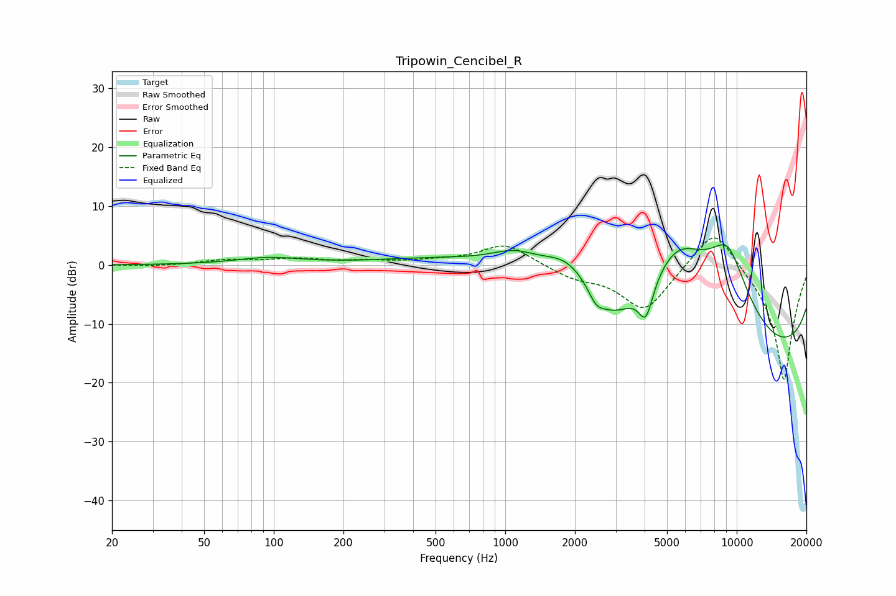

# Tripowin_Cencibel_R
See [usage instructions](https://github.com/jaakkopasanen/AutoEq#usage) for more options and info.

### Parametric EQs
Apply preamp of -3.5 dB when using parametric equalizer.

|   # | Type    |   Fc (Hz) |    Q |   Gain (dB) |
|-----|---------|-----------|------|-------------|
|   1 | Peaking |        95 | 1    |         1.2 |
|   2 | Peaking |       931 | 0.37 |         2.7 |
|   3 | Peaking |      1096 | 1.42 |         2.4 |
|   4 | Peaking |      1866 | 1.26 |         4.9 |
|   5 | Peaking |      2469 | 4.17 |        -2.2 |
|   6 | Peaking |      2941 | 1.36 |        -6.1 |
|   7 | Peaking |      4051 | 4.31 |        -6.4 |
|   8 | Peaking |      5557 | 0.72 |        15.4 |
|   9 | Peaking |      9158 | 1.1  |        14.9 |
|  10 | Peaking |     10000 | 0.18 |       -20   |

### Fixed Band EQs
When using fixed band (also called graphic) equalizer, apply preamp of **-4.7 dB** (if available) and set gains manually with these parameters.

|   # | Type    |   Fc (Hz) |    Q |   Gain (dB) |
|-----|---------|-----------|------|-------------|
|   1 | Peaking |        31 | 1.41 |        -0.2 |
|   2 | Peaking |        62 | 1.41 |         0.8 |
|   3 | Peaking |       125 | 1.41 |         0.9 |
|   4 | Peaking |       250 | 1.41 |         0.6 |
|   5 | Peaking |       500 | 1.41 |         0.5 |
|   6 | Peaking |      1000 | 1.41 |         3.7 |
|   7 | Peaking |      2000 | 1.41 |        -1.9 |
|   8 | Peaking |      4000 | 1.41 |        -7.8 |
|   9 | Peaking |      8000 | 1.41 |         7.6 |
|  10 | Peaking |     16000 | 1.41 |       -20   |

### Graphs

