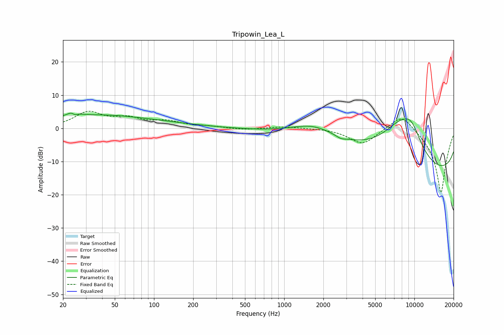

# Tripowin_Lea_L
See [usage instructions](https://github.com/jaakkopasanen/AutoEq#usage) for more options and info.

### Parametric EQs
Apply preamp of -4.7 dB when using parametric equalizer.

|   # | Type    |   Fc (Hz) |    Q |   Gain (dB) |
|-----|---------|-----------|------|-------------|
|   1 | Peaking |        24 | 4.51 |         3.7 |
|   2 | Peaking |        24 | 5.72 |        -3.2 |
|   3 | Peaking |        31 | 0.32 |         3   |
|   4 | Peaking |        70 | 4.44 |        -0   |
|   5 | Peaking |        71 | 0.29 |         1.2 |
|   6 | Peaking |      1698 | 0.7  |         6   |
|   7 | Peaking |      2724 | 3.9  |        -0.8 |
|   8 | Peaking |      7566 | 0.59 |        16.5 |
|   9 | Peaking |      9438 | 1.48 |         7.5 |
|  10 | Peaking |     10000 | 0.18 |       -19.9 |

### Fixed Band EQs
When using fixed band (also called graphic) equalizer, apply preamp of **-5.2 dB** (if available) and set gains manually with these parameters.

|   # | Type    |   Fc (Hz) |    Q |   Gain (dB) |
|-----|---------|-----------|------|-------------|
|   1 | Peaking |        31 | 1.41 |         4.6 |
|   2 | Peaking |        62 | 1.41 |         2.5 |
|   3 | Peaking |       125 | 1.41 |         1.8 |
|   4 | Peaking |       250 | 1.41 |         0.5 |
|   5 | Peaking |       500 | 1.41 |        -0.5 |
|   6 | Peaking |      1000 | 1.41 |         0.6 |
|   7 | Peaking |      2000 | 1.41 |         0.1 |
|   8 | Peaking |      4000 | 1.41 |        -4.8 |
|   9 | Peaking |      8000 | 1.41 |         5.2 |
|  10 | Peaking |     16000 | 1.41 |       -19.7 |

### Graphs

