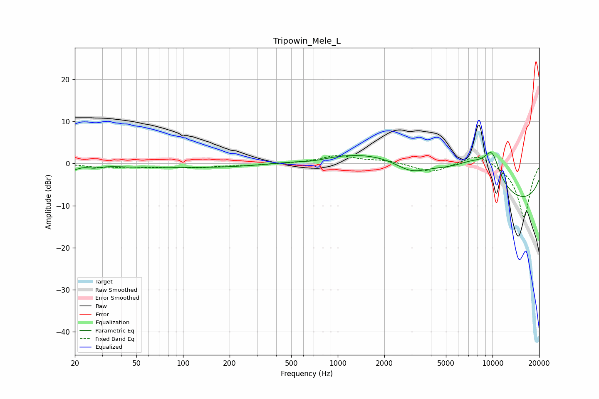

# Tripowin_Mele_L
See [usage instructions](https://github.com/jaakkopasanen/AutoEq#usage) for more options and info.

### Parametric EQs
Apply preamp of -2.7 dB when using parametric equalizer.

|   # | Type    |   Fc (Hz) |    Q |   Gain (dB) |
|-----|---------|-----------|------|-------------|
|   1 | Peaking |        20 | 4.91 |        -1   |
|   2 | Peaking |        27 | 3.01 |        -0.7 |
|   3 | Peaking |        44 | 2.17 |        -0.2 |
|   4 | Peaking |       134 | 0.31 |        -1   |
|   5 | Peaking |       700 | 1.6  |        -0.6 |
|   6 | Peaking |      2965 | 1.31 |        -3   |
|   7 | Peaking |      3377 | 0.29 |         8.3 |
|   8 | Peaking |      7492 | 1.14 |         4   |
|   9 | Peaking |      9916 | 2.24 |         7.2 |
|  10 | Peaking |      9993 | 0.18 |       -11.3 |

### Fixed Band EQs
When using fixed band (also called graphic) equalizer, apply preamp of **-2.0 dB** (if available) and set gains manually with these parameters.

|   # | Type    |   Fc (Hz) |    Q |   Gain (dB) |
|-----|---------|-----------|------|-------------|
|   1 | Peaking |        31 | 1.41 |        -0.9 |
|   2 | Peaking |        62 | 1.41 |        -0.7 |
|   3 | Peaking |       125 | 1.41 |        -0.8 |
|   4 | Peaking |       250 | 1.41 |        -0.4 |
|   5 | Peaking |       500 | 1.41 |         0   |
|   6 | Peaking |      1000 | 1.41 |         1.8 |
|   7 | Peaking |      2000 | 1.41 |         0.7 |
|   8 | Peaking |      4000 | 1.41 |        -2.2 |
|   9 | Peaking |      8000 | 1.41 |         2.6 |
|  10 | Peaking |     16000 | 1.41 |       -12.9 |

### Graphs

