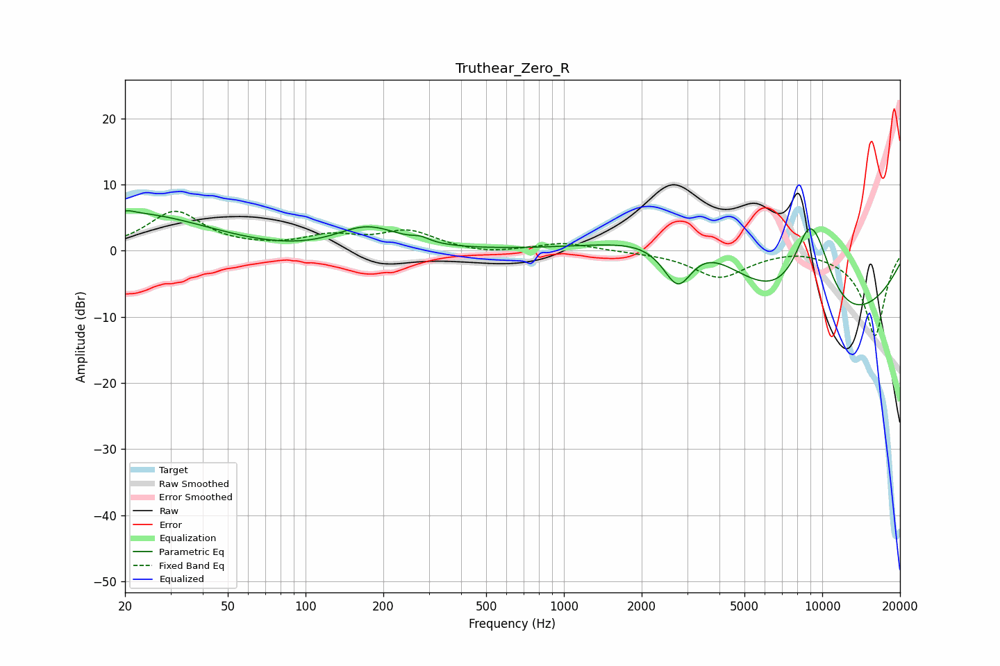

# Truthear_Zero_R
See [usage instructions](https://github.com/jaakkopasanen/AutoEq#usage) for more options and info.

### Parametric EQs
Apply preamp of -6.2 dB when using parametric equalizer.

|   # | Type    |   Fc (Hz) |    Q |   Gain (dB) |
|-----|---------|-----------|------|-------------|
|   1 | Peaking |        20 | 5.42 |         0.4 |
|   2 | Peaking |        21 | 0.39 |         8.2 |
|   3 | Peaking |        31 | 0.18 |        -2.6 |
|   4 | Peaking |       173 | 1.09 |         4.1 |
|   5 | Peaking |       279 | 4.23 |         0.6 |
|   6 | Peaking |      2767 | 2.13 |        -8.7 |
|   7 | Peaking |      3103 | 0.61 |        11.5 |
|   8 | Peaking |      8402 | 0.3  |       -15.4 |
|   9 | Peaking |      8837 | 1.78 |        10.6 |
|  10 | Peaking |      9594 | 1.74 |         5.9 |

### Fixed Band EQs
When using fixed band (also called graphic) equalizer, apply preamp of **-6.1 dB** (if available) and set gains manually with these parameters.

|   # | Type    |   Fc (Hz) |    Q |   Gain (dB) |
|-----|---------|-----------|------|-------------|
|   1 | Peaking |        31 | 1.41 |         5.9 |
|   2 | Peaking |        62 | 1.41 |         0.2 |
|   3 | Peaking |       125 | 1.41 |         2   |
|   4 | Peaking |       250 | 1.41 |         2.8 |
|   5 | Peaking |       500 | 1.41 |        -0.6 |
|   6 | Peaking |      1000 | 1.41 |         1.2 |
|   7 | Peaking |      2000 | 1.41 |        -0.1 |
|   8 | Peaking |      4000 | 1.41 |        -4   |
|   9 | Peaking |      8000 | 1.41 |         0.6 |
|  10 | Peaking |     16000 | 1.41 |       -12.9 |

### Graphs

