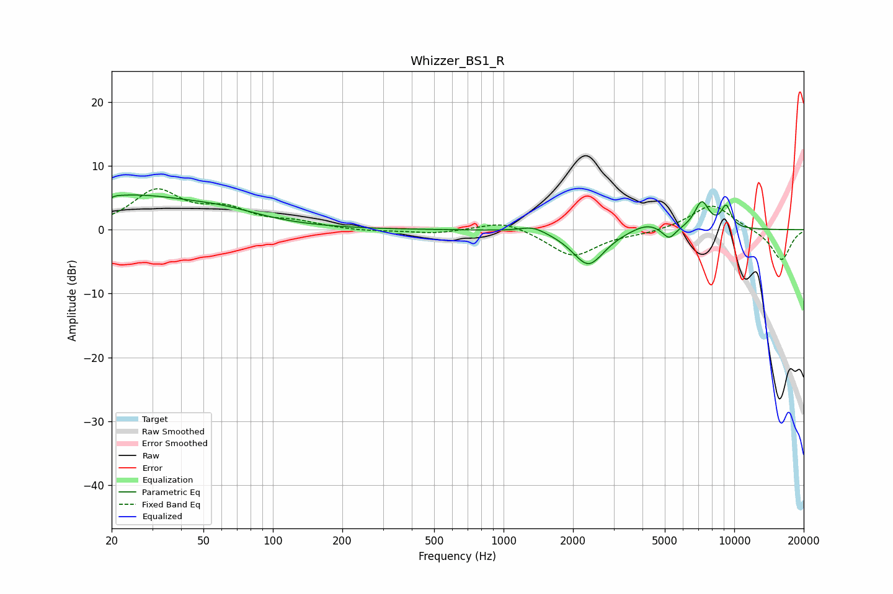

# Whizzer_BS1_R
See [usage instructions](https://github.com/jaakkopasanen/AutoEq#usage) for more options and info.

### Parametric EQs
Apply preamp of -5.5 dB when using parametric equalizer.

|   # | Type    |   Fc (Hz) |    Q |   Gain (dB) |
|-----|---------|-----------|------|-------------|
|   1 | Peaking |        20 | 5.94 |        -3.2 |
|   2 | Peaking |        20 | 5.98 |         3   |
|   3 | Peaking |        23 | 0.45 |         5.2 |
|   4 | Peaking |        62 | 0.86 |         1.3 |
|   5 | Peaking |      1342 | 2.53 |         1   |
|   6 | Peaking |      2333 | 2.04 |        -5.6 |
|   7 | Peaking |      4190 | 1.95 |         1.3 |
|   8 | Peaking |      5217 | 4.68 |        -2   |
|   9 | Peaking |      7230 | 4.2  |         4.3 |
|  10 | Peaking |      9224 | 5.76 |         3.4 |

### Fixed Band EQs
When using fixed band (also called graphic) equalizer, apply preamp of **-6.5 dB** (if available) and set gains manually with these parameters.

|   # | Type    |   Fc (Hz) |    Q |   Gain (dB) |
|-----|---------|-----------|------|-------------|
|   1 | Peaking |        31 | 1.41 |         5.9 |
|   2 | Peaking |        62 | 1.41 |         2.7 |
|   3 | Peaking |       125 | 1.41 |         1   |
|   4 | Peaking |       250 | 1.41 |        -0.3 |
|   5 | Peaking |       500 | 1.41 |        -0.6 |
|   6 | Peaking |      1000 | 1.41 |         1.6 |
|   7 | Peaking |      2000 | 1.41 |        -4.2 |
|   8 | Peaking |      4000 | 1.41 |        -0.5 |
|   9 | Peaking |      8000 | 1.41 |         4.1 |
|  10 | Peaking |     16000 | 1.41 |        -4.9 |

### Graphs

