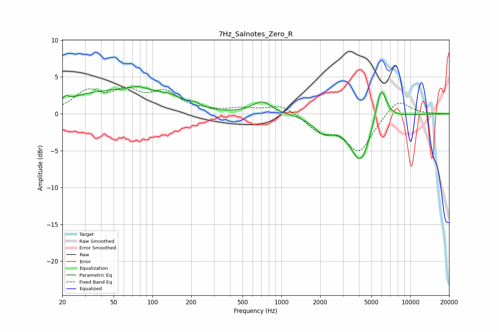

# 7Hz_Salnotes_Zero_R
See [usage instructions](https://github.com/jaakkopasanen/AutoEq#usage) for more options and info.

### Parametric EQs
Apply preamp of -3.8 dB when using parametric equalizer.

|   # | Type    |   Fc (Hz) |    Q |   Gain (dB) |
|-----|---------|-----------|------|-------------|
|   1 | Peaking |        21 | 6    |         0.7 |
|   2 | Peaking |        29 | 0.84 |         1.5 |
|   3 | Peaking |        61 | 1.96 |        -0.9 |
|   4 | Peaking |        67 | 0.82 |         3.7 |
|   5 | Peaking |       138 | 1.41 |         1.2 |
|   6 | Peaking |       214 | 2.76 |         0.5 |
|   7 | Peaking |       707 | 1.92 |         1.7 |
|   8 | Peaking |      2136 | 1.82 |        -2   |
|   9 | Peaking |      4115 | 1.7  |        -6.5 |
|  10 | Peaking |      5918 | 3.13 |         5.2 |

### Fixed Band EQs
When using fixed band (also called graphic) equalizer, apply preamp of **-3.7 dB** (if available) and set gains manually with these parameters.

|   # | Type    |   Fc (Hz) |    Q |   Gain (dB) |
|-----|---------|-----------|------|-------------|
|   1 | Peaking |        31 | 1.41 |         2.8 |
|   2 | Peaking |        62 | 1.41 |         2.6 |
|   3 | Peaking |       125 | 1.41 |         2.6 |
|   4 | Peaking |       250 | 1.41 |         0.3 |
|   5 | Peaking |       500 | 1.41 |         0.6 |
|   6 | Peaking |      1000 | 1.41 |         1.3 |
|   7 | Peaking |      2000 | 1.41 |        -2.1 |
|   8 | Peaking |      4000 | 1.41 |        -5   |
|   9 | Peaking |      8000 | 1.41 |         2.2 |
|  10 | Peaking |     16000 | 1.41 |         0   |

### Graphs

