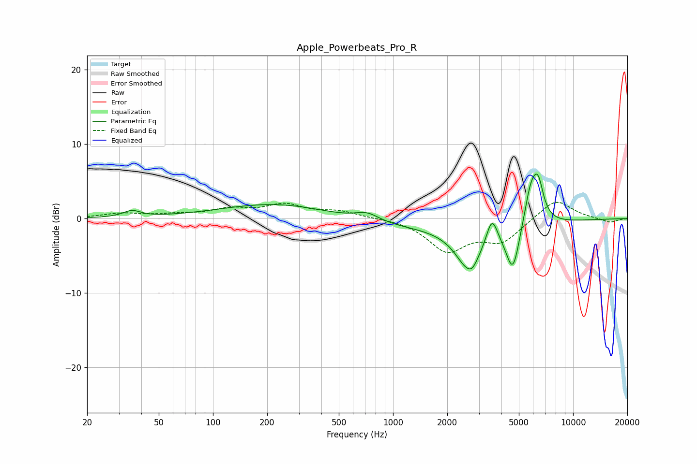

# Apple_Powerbeats_Pro_R
See [usage instructions](https://github.com/jaakkopasanen/AutoEq#usage) for more options and info.

### Parametric EQs
Apply preamp of -6.1 dB when using parametric equalizer.

|   # | Type    |   Fc (Hz) |    Q |   Gain (dB) |
|-----|---------|-----------|------|-------------|
|   1 | Peaking |        35 | 3.01 |         0.9 |
|   2 | Peaking |       247 | 0.44 |         2.4 |
|   3 | Peaking |       717 | 2.14 |         1.1 |
|   4 | Peaking |      1429 | 0.2  |        -1.4 |
|   5 | Peaking |      2639 | 1.92 |        -5.4 |
|   6 | Peaking |      2756 | 5.99 |        -0.5 |
|   7 | Peaking |      3542 | 4.61 |         3.6 |
|   8 | Peaking |      4632 | 3.59 |        -6.4 |
|   9 | Peaking |      5852 | 3.45 |         5.5 |
|  10 | Peaking |      6413 | 4.86 |         3.9 |

### Fixed Band EQs
When using fixed band (also called graphic) equalizer, apply preamp of **-2.3 dB** (if available) and set gains manually with these parameters.

|   # | Type    |   Fc (Hz) |    Q |   Gain (dB) |
|-----|---------|-----------|------|-------------|
|   1 | Peaking |        31 | 1.41 |         0.6 |
|   2 | Peaking |        62 | 1.41 |         0.4 |
|   3 | Peaking |       125 | 1.41 |         1.1 |
|   4 | Peaking |       250 | 1.41 |         1.7 |
|   5 | Peaking |       500 | 1.41 |         0.9 |
|   6 | Peaking |      1000 | 1.41 |         0.1 |
|   7 | Peaking |      2000 | 1.41 |        -4.2 |
|   8 | Peaking |      4000 | 1.41 |        -2.9 |
|   9 | Peaking |      8000 | 1.41 |         2.7 |
|  10 | Peaking |     16000 | 1.41 |        -0.6 |

### Graphs

