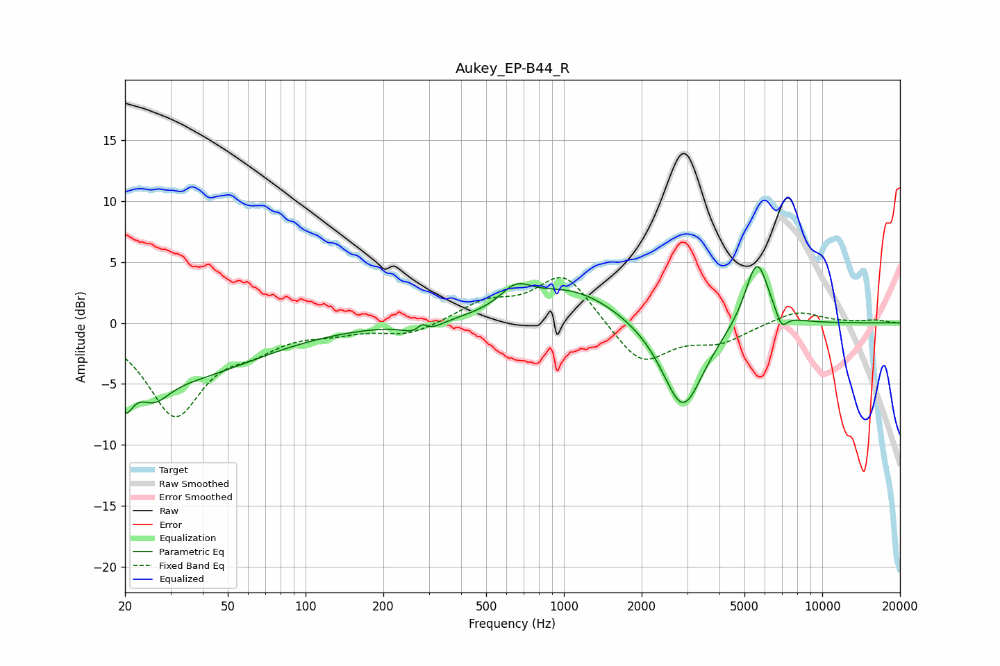

# Aukey_EP-B44_R
See [usage instructions](https://github.com/jaakkopasanen/AutoEq#usage) for more options and info.

### Parametric EQs
Apply preamp of -4.7 dB when using parametric equalizer.

|   # | Type    |   Fc (Hz) |    Q |   Gain (dB) |
|-----|---------|-----------|------|-------------|
|   1 | Peaking |        20 | 4.77 |        -3.2 |
|   2 | Peaking |        26 | 2.31 |        -2.1 |
|   3 | Peaking |        33 | 0.48 |        -4.2 |
|   4 | Peaking |       281 | 3.06 |        -1.6 |
|   5 | Peaking |       283 | 5.92 |         1.3 |
|   6 | Peaking |       651 | 2.35 |         1.7 |
|   7 | Peaking |      1069 | 0.77 |         2.8 |
|   8 | Peaking |      2886 | 1.74 |        -7.5 |
|   9 | Peaking |      5585 | 2.95 |         5.6 |
|  10 | Peaking |      6953 | 5.94 |        -1.4 |

### Fixed Band EQs
When using fixed band (also called graphic) equalizer, apply preamp of **-3.8 dB** (if available) and set gains manually with these parameters.

|   # | Type    |   Fc (Hz) |    Q |   Gain (dB) |
|-----|---------|-----------|------|-------------|
|   1 | Peaking |        31 | 1.41 |        -7.4 |
|   2 | Peaking |        62 | 1.41 |        -1.5 |
|   3 | Peaking |       125 | 1.41 |        -0.6 |
|   4 | Peaking |       250 | 1.41 |        -1   |
|   5 | Peaking |       500 | 1.41 |         1.6 |
|   6 | Peaking |      1000 | 1.41 |         4.1 |
|   7 | Peaking |      2000 | 1.41 |        -3.5 |
|   8 | Peaking |      4000 | 1.41 |        -1.4 |
|   9 | Peaking |      8000 | 1.41 |         1.1 |
|  10 | Peaking |     16000 | 1.41 |         0.2 |

### Graphs

